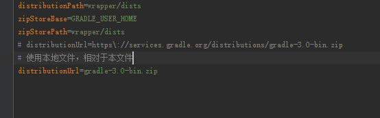

IntelliJ IDEA 是很好的 IDE， 但是免费的社区版不直接支持开发 Web 项目。所以需要自己配置。
网上大多是教程都是用 Maven 和 jetty 来配置。我刚学 JAVA。因此直接从 Gradle 上手配置了。

这里直接用写一个 Servlet 的 Helloworld，记录下踩过的坑，让后来的人少走弯路。
在这之前请自行安装 Gradle 并使其能全局运行。了解基本的 Gradle 的概念。本文默认读者会使用 Gradle。

## 下载安装 IntelliJ IDEA Community
https://www.jetbrains.com/idea/

## 新建项目
1. 用 Gradle 新建项目
项目目录下，命令行运行
```
gradle init --type java-library
```


2. 编辑 build.gradle
这是我的配置
```
/*
 * This build file was auto generated by running the Gradle 'init' task
 * by 'Yang' at '16-9-18 下午5:48' with Gradle 3.0
 *
 * This generated file contains a sample Java project to get you started.
 * For more details take a look at the Java Quickstart chapter in the Gradle
 * user guide available at https://docs.gradle.org/3.0/userguide/tutorial_java_projects.html
 */

// Tomcat 需要
buildscript {
    repositories {
        mavenCentral()
    }

    dependencies {
        classpath "com.bmuschko:gradle-tomcat-plugin:2.2.3"
    }
}

// 要使用的插件，看名字应该知道什么作用
// Apply the java plugin to add support for Java
apply plugin: 'java'
apply plugin: 'idea'
apply plugin: 'war'
apply plugin: "com.bmuschko.tomcat"


// In this section you declare where to find the dependencies of your project
repositories {
    // Use 'jcenter' for resolving your dependencies.
    // You can declare any Maven/Ivy/file repository here.
    // jcenter()

    // maven 的仓库
    mavenCentral()
}

// In this section you declare the dependencies for your production and test code
dependencies {
    // The production code uses the SLF4J logging API at compile time
    compile 'org.slf4j:slf4j-api:1.7.21'

    // 依赖 servlet
    compile group: 'javax.servlet', name: 'javax.servlet-api', version: '3.0.1'

    // Declare the dependency for your favourite test framework you want to use in your tests.
    // TestNG is also supported by the Gradle Test task. Just change the
    // testCompile dependency to testCompile 'org.testng:testng:6.8.1' and add
    // 'test.useTestNG()' to your build script.
    testCompile 'junit:junit:4.12'

    // 配置 Tomcat 插件
    def tomcatVersion = '8.0.27'
    tomcat   "org.apache.tomcat.embed:tomcat-embed-core:${tomcatVersion}",
            "org.apache.tomcat.embed:tomcat-embed-logging-juli:${tomcatVersion}",
            "org.apache.tomcat.embed:tomcat-embed-jasper:${tomcatVersion}"
}

// Tomcat 配置
// Tomcat 配置tomcatRun.contextPath = 'testa/'
tomcatRunWar.contextPath = 'teats/'
```
3. 运行命令
注意第一次使用 gradlew 命令，可能会很慢，但是配置 gradlew 仍然有必要。因为后面 idea 运行 Tomcat 会使用这个命令。
你可以在 gradle/wrapper/gradle-wrapper.properties 中配置一下使用本地文件加快速度。


配置离线工作也可加快速度
>File > Settings > Build, Execution & Deployment > Compiler > Compiler
>and de-select Configure on demand
>The above still uses data but is faster, I was able to load images and maps. However, in addition, if >you want to be completely offline, you need to do the following:
 >File -> Settings ->Build, Execution,Deployment -> Build Tools -> Gradle ->
>check Offline work

试试有没有配置成功
```
gradlew build # 编译项目
gradlew tasks # 查看任务
```

4. 创建 idea 项目文件
```
gradlew idea
```
如果之后项目更新了依赖，可以运行下面的命令同步到 idea
```
gradlew cleanIdea
```

5. 用 Idea 打开项目
直接用 idea 打开 ipr 文件
按 alt + 1 可以显示文件导航侧栏

## 配置调试环境
1. 配置远程调试
进入运行配置界面


点击 +  remote

写一个名字，其他直接默认就好。可以把第一行参数复制出来下一步使用，即：
```
-agentlib:jdwp=transport=dt_socket,server=y,suspend=n,address=5005
```
2. 配置 Tomcat 运行
同上步骤，进入运行配置界面
点击 + Gradle


第一行根据自己项目填写 gradle build 的位置
第二行输入 tomcatRun
第三行填上一个步骤复制下来的参数。

## 编写 Helloworld
```
package main.java;

/*
 * This Java source file was auto generated by running 'gradle buildInit --type java-library'
 * by 'Yang' at '16-9-18 下午5:48' with Gradle 3.0
 *
 * @author Yang, @date 16-9-18 下午5:48
 */

import javax.servlet.ServletException;
import javax.servlet.annotation.WebServlet;
import javax.servlet.http.HttpServlet;
import javax.servlet.http.HttpServletRequest;
import javax.servlet.http.HttpServletResponse;
import java.io.IOException;
import java.io.Writer;

@WebServlet("/")
public class Library  extends HttpServlet{
    @Override
    protected void doGet(HttpServletRequest req, HttpServletResponse resp) throws ServletException, IOException {
        Writer writer = resp.getWriter();
        writer.write("HelloWorld!");
        writer.flush();
        writer.close();
        super.doGet(req, resp);
    }
}
```

## 运行调试
1. 运行


>这里注意 src/main 下面必须有 webapp 目录，空目录都要。不然访问会出现 404 错误
>

2. 调试
选择之前配置的远程 debug 配置


打断点
重新访问查看调试结果


## 参考

1. <http://yukinami.github.io/2015/07/29/gradle-tomcat-plugin-404/>
2. <http://www.cnblogs.com/woshimrf/p/5779811.html>
3. <http://stackoverflow.com/questions/18158034/how-to-setup-android-studio-to-work-completely-offline>
4. <http://www.cnblogs.com/huang0925/p/3458507.html>
