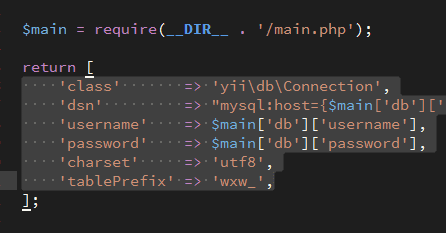
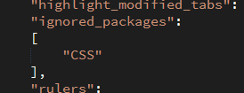
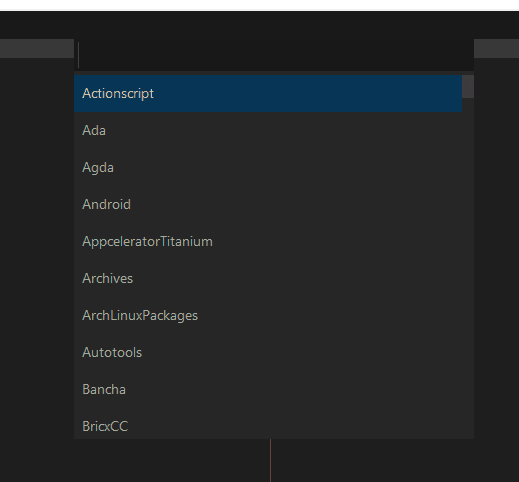
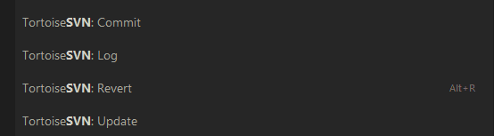
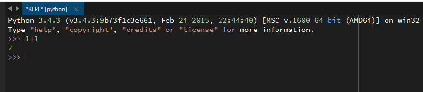
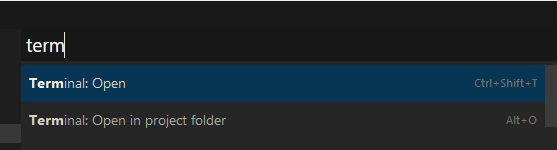

> 后记：很久不用 Sublime Text 编辑器了。现在写前端和 PHP 已经切换到 VSCode，JAVA 和 Kotlin 切换到 IntelliJ IDEA

## 前言
作为一个 Web 开发者，主要写 PHP，前端 React Vue 相关技术栈，我选择使用 Sublime Text 3 开开展我的开发工作。
本文假设您已经安装好了Sublime Text 3 并且能使用 All Autocomplete 安装插件。

## Alignment —— 自动对齐
要实现如下效果，直接按一个键就行啦。但是现在我越来越不喜欢这种写法。因为如果将来要多增加一行，指不定又要排列一次，然后在代码版本里又会变动多行。

## All Autocomplete —— 补全代码
这个插件可以在所有打开的文件中自动查找补全

## AutoFileName —— 自动补全文件路径和文件名

## BracketHighlighter —— 高亮括号引号配对
这个插件不仅提供高亮括号功能，还提供一系列快捷键操作方便快速跳转匹配括号或许选择选区。

## ChineseLoremIpsum —— 生成中文文字占位符
输入 clorem 然后按 Alt + C 即可生成若干随机词汇

## Color Highlighter —— 高亮颜色
这个插件会把可能是颜色值的字符串着色成相应颜色

## CSS3 —— CSS 3 的支持
使用前请在配置文件中禁用 Sublime Text 自带的 CSS 插件。

## DocBlockr —— 规范注释插件
PHP 和 JS 中都可以使用

## EditorConfig —— editorconfig 文件语法的支持
帮助项目的代码风格统一。

## EditorConfigSnippets —— editorconfig 代码片段
帮助快速生成 .editorconfig 文件。

## Emmet —— 快速书写 HTML 神器
可以使用选择器语法来快速书写 HTML ，前端必备神器。

## Gist —— 管理 Gist 代码片段
实际体验并不好，很少使用

## Git Conflict Resolver —— 快速查找 git 代码冲突
执行 git rebase 命令后，常常会出现 conflict，这款插件可以帮助快速定位冲突位置。强烈推荐安装。

##  Gitignore —— 快速创建 git 忽略文件
这个插件支持多种语言/项目/编辑器的 .gitignore 文件的生成。

## Inc-Dec-Value —— 增减数字
按住Ctrl + 上/下键可以快速增减数字

## jQuery —— JQuery 的支持

## MarkdownEditing —— markdown 格式增强支持
友好的界面高亮 markdown或txt 文件。并且支持 GFM 拓展的 markdown 格式。

## MultiEditUtils —— 选区增强插件
本来 Sublime Text 的选区功能相当强大，这款插件更是增强了相关功能。
我最常用多选区分别编辑功能，强烈建议使用。

## OpenPath —— 快速打开项目文件夹或当前文件夹

## Phpcs —— PHP 代码规范检查工具
这个插件可以检查写的 PHP 代码风格是否符合 PSR 标准，并且对代码进行一些分析，如变量是否被使用，是否用了未声明的变量，变量名长度，代码复杂度检测。
更多 PHP 代码质量相关工具 http://www.putaor.com/?p=341

## Placeholders —— 生成占位代码

## sass —— sass 和 scss 支持

## SASS Snippets —— sass 代码片段

## SideBarEnhancements —— 侧边栏增强

## Sublimerge 3 —— 文件对比插件
很强大的插件，可以从文件，历史版本，其他分支，剪切板对比文件。强烈安利。

## TortoiseSVN —— 乌龟 SVN

## Vue Syntax Highlight —— vue 支持

## Xdebug Client —— PHP Xdebug 插件
有时很不稳定，不怎么使用了。
安装配置参考 [Windows 下 Sublime Text 3 使用 Xdebug （配合Xdebug helper 插件）.md](./Windows%20%E4%B8%8B%20Sublime%20Text%203%20%E4%BD%BF%E7%94%A8%20Xdebug%20%EF%BC%88%E9%85%8D%E5%90%88Xdebug%20helper%20%E6%8F%92%E4%BB%B6%EF%BC%89.md)

## Anaconda —— 讲 sublime 打造成 python 开发 IDE
有强大的的提示和代码分析，就是时不时弹窗报错很诡异。

## ASCII Decorator —— 讲英文字符转换为 ascii 图像
基本没有太大用处。

## AsciiGraph —— 绘制流程图
本来不支持 windows，前不久我给作者提了一个 pr 现在已经支持。对中文支持不太友好。

## Autoprefixer —— 自动给 CSS 代码补上前缀

## Babel —— bable 文件的支持

## ConvertToUTF8 —— 打开非 UTF-8 编码文件必备

## JavaScript Completions —— js 补全插件
支持多个库。

## LiveStyle —— 可视化样式编写
配合浏览器可以让页面开发更加高效，但是现在前端更改了工作方式。使用 webpack 后已经不再用它了。

## PlainTasks —— Sublime 里的 TODO list

## SublimeREPL —— 在 Sublime Text 里面运行解释器

## Terminal —— 快速打开终端
配合快捷键更好用。

## WakaTime —— 统计编码时间
看看每周多少时间花费在编码上。免费版只能看最近 7 天的数据。

