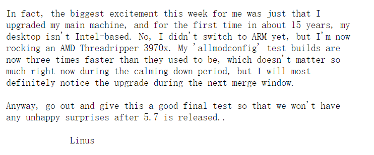

## 背景

最近搬家了，在家里工作了几天。用我的超便携小电脑 + 显示器 + 键鼠的模式干了几天的活儿，总感觉不太得劲。

说起这超级便携的小电脑，[壹号本 7寸 8G内存 8100Y 处理器](https://union-click.jd.com/jdc?e=&p=AyIGZRtZFQsTBV0cXRMyEANVHloRAxcAUBNrUV1KWQorAlBHU0VeBUVNR0ZbSkdETlcNVQtHRVNSUVNLXANBRA1XB14DS10cQQVYD21XHgVRG14UBhMCUh5TJXRSbBVLOmh7clwzb1xJWmcHFUkmdFQeC2UaaxUDEwVWHVwXAhM3ZRtcJUN8AVMTWBcDIgZlG18dCxYFVxNfEQUbB2UcWxwyVE8eUwVPMiI3VitrJQIiBGVZNRRSEQ9TSwkTBhJUUx5ZEwcaAVESD0IFEARQT1wTC0dTZRlaFAYb)，不到 4000 的价格，超级便携加上酷睿 8 代处理器的性能，我非常喜欢。平时出个远门带着，有点啥事可以立马处理。比如公司组织爬山活动，做运维的大哥们就不需要背着厚重的笔记本了，这款一斤多点的小机器就挺好。

放点小电脑的美照：

扯远了回归正题。现在不考虑便携性了，性能在加强一下，就换台式机吧。

## 装机预算

要想配一台可以用比较长时间的机器，那么性能一定要留下些冗余。所以预算还是高一点好。

确定这台电脑主要要干的活儿：前后端开发、流畅运行虚拟机、docker、WSL Linux 子系统、偶尔的机器学习（需要 Nvidia 显卡）。

这样一考虑下来，预算就五千往上了。但是想想配置一台性能好的机器，工作也愉悦，还能用个好几年，挺划算。

## AMD Yes

CPU 我选择了比较火热的 [AMD 锐龙 3700X (r7)7nm 8核16线程 3.6GHz 65W](https://union-click.jd.com/jdc?e=&p=AyIGZRprFQMTBlQcWR0CEwFcKx9KWkxYZUIeUENQDEsFA1BWThgJBABAHUBZCQUdRUFGGRJDD1MdQlUQQwVKDFRXFk8jQA4SBlQaWhIAGgdUHVIlVmoPIk4jTVt3USd9OUVfVgMOfgBBYh4LZRprFQMTBVYdXBcCEzdlG1wlVHwHVBpaFAMTAVQcaxQyEgNdEl8XAxIHVR5aFDIVB1wrHV1JWlkPK2slASI3ZRtrFjJQaQZOWxQLRwddGgsVABcBVEkLEQATAVRMCRVSRwIFEw4XMhAGVB9S)，价格两千元出头，网上测评也很多，性价比相当高。

为什么用选择 AMD 平台不用 Intel 处理器了？就是因为性价比高呀！如果你不是特别需要做 Intel 平台相关的事情，现在切换到 AMD 平台是相当明智的选择。连 Linux 之父都换 AMD 平台了，你还在等什么呢（大笑）。[Linus Torvalds 切换到 AMD 处理器，15 年来首次不用 Intel。](https://www.oschina.net/news/115941/linus-torvalds-intel-amd-ryzen-threadripper)

## 最终装机单

最后综合考虑，我选择了如下的配置：

| 类型   | 名称                        | 价格         |
|:------:|:---------------------------:|------------:|
| CPU  | [AMD 锐龙 3700X](https://union-click.jd.com/jdc?e=&p=AyIGZRprFQMTBlQcWR0CEwFcKx9KWkxYZUIeUENQDEsFA1BWThgJBABAHUBZCQUdRUFGGRJDD1MdQlUQQwVKDFRXFk8jQA4SBlQaWhIAGgdUHVIlVmoPIk4jTVt3USd9OUVfVgMOfgBBYh4LZRprFQMTBVYdXBcCEzdlG1wlVHwHVBpaFAMTAVQcaxQyEgNdEl8XAxIHVR5aFDIVB1wrHV1JWlkPK2slASI3ZRtrFjJQaQZOWxQLRwddGgsVABcBVEkLEQATAVRMCRVSRwIFEw4XMhAGVB9S)              | 2,149\.00  |
| 内存   | [金士顿 骇客神条 32G 3200](https://union-click.jd.com/jdc?e=&p=AyIGZRprFQMTBlQdXBYLEABcKx9KWkxYZUIeUENQDEsFA1BWThgJBABAHUBZCQUdRUFGGRJDD1MdQlUQQwVKDFRXFk8jQA4SBlQaWhMFEQ5XHFIlZ04BHBMzUH13By9zEF1aV14UUAtrVB4LZRprFQMTBVYdXBcCEzdlG1wlVHwHVBpaFAMTB10YaxQyEgNdEl8XAxIAUR5ZFTIVB1wrHV1JWlkPK2slASI3ZRtrFjJQaVEcXhMBQgVcGQgWChdTAh4IHAASAQUbXRNQGwRcHQhGMhAGVB9S)             | 979\.00    |
| 显卡   | [微星  GTX 1660](https://union-click.jd.com/jdc?e=&p=AyIGZRprFQMTBlQZUhEGEgNcKx9KWkxYZUIeUENQDEsFA1BWThgJBABAHUBZCQUdRUFGGRJDD1MdQlUQQwVKDFRXFk8jQA4SBlQaWhcLFgNVH1IlfFBDAmEZZWpyXC9QGGFETGJXe1JpVB4LZRprFQMTBVYdXBcCEzdlG1wlVHwHVBpaFAMTBFIcaxQyEgNdEl8XAxEAVx5ZHDIVB1wrHV1JWlkPK2slASI3ZRtrFjJQaQEeWkdWEQRdS1wRVxcDARJTHQMSUAFOUhQLEA5XHlpHMhAGVB9S)              | 1,499\.00  |
| 主板   | [技嘉 B550I AORUS PRO AX](https://union-click.jd.com/jdc?e=&p=AyIGZRtSEwcRD1AeWhYyFAZTGFoXAhEOVx9rUV1KWQorAlBHU0VeBUVNR0ZbSkdETlcNVQtHRVNSUVNLXANBRA1XB14DS10cQQVYD21XHgFUHVgUABIEXBlfJQBtZTdzB1dycG8vHxN%2BcUtkBkEQcWIeC2UaaxUDEwVWHVwXAhM3ZRtcJUN8B1QYWxwGEAZlGmsVBhoOURlaFgMRBFEaaxICGzcTUxBdXEg3ZStYJTIiB2UYa1dsElIGTg8TAEYBUkkJEAtFDlwZXEFXQgIFGQtFV0UHVkxrFwMTA1w%3D)     | 1,598\.00  |
| 电源   | [全汉 MS600 600W](https://union-click.jd.com/jdc?e=&p=AyIGZRtbEgURAFAfWxEyFAJUHloUAyJDCkMFSjJLQhBaGR4cDF8QTwcKXg1cAAQJS14MQQVYDwtFSlMTBAtHR0pZChUdRUFGfwAXXRADFwZUGmtGQRBuNkskSWBEZVxEAlJidX5VWhpDDh43VCtbFAMQBFMcWRUDIjdVHGtXbEVFFFoYS0RGRGUaaxUGGg5RGVoXARsCVxlrEgIbNxNTEF1cSDdlK1glMiIHZRhrV2wWAFcdUxcCRVUGGVkQAxcBXUgJHQEXAgVMCxdQFQAHGmsXAxMDXA%3D%3D)             | 609\.00    |
| 机箱   | [LIANLI 小犀牛TU150](https://union-click.jd.com/jdc?e=&p=AyIGZRprFQMTBlQcXBcCEABSKx9KWkxYZUIeUENQDEsFA1BWThgJBABAHUBZCQUdRUFGGRJDD1MdQlUQQwVKDFRXFk8jQA4SBlQaWhIFEAdXHFwlX1VhPHojbUV3TwlaImJ1YHodHRhrYh4LZRprFQMTBVYdXBcCEzdlG1wlVHwHVBpaFQMVDlEaaxQyEgNdEl8XAxAOUxNSFjIVB1wrHV1JWlkPK2slASI3ZRtrFjJQaVFMCxUKQQECHFIVARcOVRwLRwcaUgJIXBUHEVACGF9CMhAGVB9S)           | 859\.00    |
| 机械硬盘 | [东芝 DT01ACA100 1TB](https://union-click.jd.com/jdc?e=&p=AyIGZRprHAIUDlQZa1FdSlkKKwJQR1NFXgVFTUdGW0pHRE5XDVULR0VTUlFTS1wDQUQNVwdeA0tdHEEFWA9tVx4OVR1SFAAiUQYbAUdZdXgwAS1XC2sGD11YfEITQVkXaxQyEgZUGVgTBRAHVCtrFQUiUTsbWhQDEwZUGVgcMhM3VR9THAYQBlAbXhMEFDdSG1IlRFpMHUUBJTIiBGUraxUyETcXdVoUUkAPU0tcFAcWV1BIX0ILQFBUG11FABQCUUxTEwMSN1caWhEL)         | 259\.00    |
| 固态硬盘 | [三星 NVMe 970 EVO Plus 500G](https://union-click.jd.com/jdc?e=&p=AyIGZRheFQITBlwfUhUyEgZUGloXAhsHVRtaJUZNXwtEa0xHV0YXEEULWldTCQQHCllHGAdFBwtEQkQBBRxNVlQYBUkeTVxNCRNLGEF6RwtVGloUAxAHXBtbFQMiUQBYD2wLdB02ZVhyQHkAU3taZVtSQVkXaxQyEgZUGVgTBRAHVCtrFQUiRTtNHldKEgRXK1olAhYPXB9ZFAcWBFIcWSUFEg5lXRNeSkxdZStrFjIiN1UrWCVAfFRWTl4cABtTARheFAcaVVcSWEFSElQHTF8SUEcAUhoPJQATBlES) | 699\.00    |
| 散热器  | [利民刺灵 AS120](https://union-click.jd.com/jdc?e=&p=AyIGZRprFQMTBlQeWhcFFQFTKx9KWkxYZUIeUENQDEsFA1BWThgJBABAHUBZCQUdRUFGGRJDD1MdQlUQQwVKDFRXFk8jQA4SBlQaWhADEABSHV0lZHZyMwEfQQtxXFJQAFVYa2QpQUVAVB4LZRprFQMTBVYdXBcCEzdlG1wlVHwHVBpaFAoaAVcbaxQyEgNdEl8XAxcOVBxfEjIVB1wrHV1JWlkPK2slASI3ZRtrFjJQaVVMX0IERw8CG1MUVhdUARNTFwVBDlRJW0cGEVRdHw8dMhAGVB9S)               | 109\.00    |
| 合计   |                           | 8,760\.00  |

## 可以节省的地方

我比较中意体积小巧的机箱，选择了 **迷你ITX** 类型的主板。因为不是主流的配置，所以部分器件价格就高些了。如果选择正常尺寸的主板，可选择的便宜机箱会很多，电源也没必要用 sfx 电源，这样又能剩下一笔。正常尺寸的主板可选的也会很多，购买 CPU 和 主板套装也能省下一点。总的算下来同等规格配置下，可能可以再便宜一两千吧。如果对显卡性能没有要求，也可以看看带核显的处理器，把预算压到五千以内应该没问题。

## 显示器也很重要

光有一台性能强劲的主机，对于提升生产力还是不够的，还需要显示器，键盘，鼠标配合。键盘这不必说，相信大家都有一把趁手的键盘了。显示器我选择了 **[戴尔 D2720DS](https://union-click.jd.com/jdc?e=&p=AyIGZRprFQMTBlQcWBAFGgJSKx9KWkxYZUIeUENQDEsFA1BWThgJBABAHUBZCQUdRUFGGRJDD1MdQlUQQwVKDFRXFk8jQA4SBlQaWhIBFwBdHlwlAU1zVnoYTwVwTA1nU3cDYGQCT18dYh4LZRprFQMTBVYdXBcCEzdlG1wlVHwHVBpaFAMTBFYeaxQyEgNdEl8UAxEEUBNfFDIVB1wrHV1JWlkPK2slASI3ZRtrFjJQaVdLDBdQFQNST1pFARcHARoIFQsUAVFPWhBRRlJUHg8TMhAGVB9S)**。

我个人不喜欢光面曲面屏，正常就好，大小27寸差不多，太大太小都影响效率。再就是分辨率也不要太高，1080p 的落后了就上2k就行，不需要4k。另外刷新帧率，色彩范围等参数我也不是很注重。易用性上至少要支持升降旋转，不要外挂电源拖一屁股累赘，也不要用触摸按钮调整功能，我更喜欢物理按钮一点。因此我选择了这款性价比高的显示器。

这款显示器比较呆，没有那么多智能功能和情景模式，于是我写了个 [定时任务自动调整显示器亮度](https://purocean.github.io/%E4%BD%BF%E7%94%A8ddc-ci%E5%8D%8F%E8%AE%AE%E8%B0%83%E6%95%B4%E6%98%BE%E7%A4%BA%E5%99%A8%E4%BA%AE%E5%BA%A6/)，算是用脚本弥补了这一块。反正这几天使用下来非常满意。

## 小插曲

经过一番装机工作，接上电源，按下电源键，显示器主板一次性点亮成功。然后装上系统，美滋滋地跑分测速，40多万的娱乐大师分数真是让人心潮澎湃。

然而好景不长，第二天早上起来再开机，主板就点不亮了。最后用排除法，测试出两条内存条中的一条有毛病，插上它主板就点不亮。联系客服退货重新买（换货流程就长了，狗东重新买当天就到），装上解决。

现在机器连续运行了一两天很稳定。可能是运气不好吧，终生保固的内存条故障被我赶上了。

## 结尾

现在这台机器性能我很满意，流畅得一逼，之前需要 30 多秒才能完成的编译任务，现在只需要 5 秒就能完成。生产力提升杠杠的！一个好的机器可以提升效率，提升工作愉悦度，相当划算。

这两年 AMD 也翻身了，不再是前几年那种装机都不考虑的情况了。欢迎大家加入 ADM 阵营，倒逼 Intel 不要再挤牙膏了。
