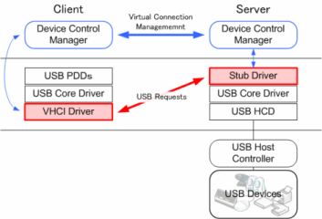

最近翻出了尘封已久的 HackRF One，寻摸着在 WSL2 里面用起来。于是找了一圈怎样在 WSL2 中使用 USB 设备，这里记录一下踩的坑，方便后人参考。

> 后续：WSL2 中无法使用 HackRF One，报错 `hackrf_set_freq() failed: USB error (-1000)`。大概是 USB/IP 不能满足 HackRF 的通信要求吧。

## USB/IP 介绍

[USB/IP][1][^1] 项目旨在开发一个基于 IP 网络的通用 USB 设备共享系统。为了在具有完整功能的计算机之间共享 USB 设备，USB/IP 将“USB I/O 消息”封装到 TCP/IP 有效负载中并在计算机之间传输它们。原始 USB 设备驱动程序和应用程序也可用于远程 USB 设备，无需对其进行任何修改。计算机可以像直接连接一样使用远程 USB 设备；例如，我们可以...

+   USB 存储设备：fdisk、mkfs、挂载/卸载、文件操作、播放 DVD 电影和录制 DVD-R 媒体。
+   USB 键盘和 USB 鼠标：与 linux 控制台和 X Window 系统一起使用。
+   USB 网络摄像头和 USB 扬声器：查看网络摄像头、捕获图像数据和播放音乐。
+   USB 打印机、USB 扫描仪、USB 串行转换器和 USB 以太网接口：好的，工作正常。

它目前作为 Linux 设备驱动程序实现，并在开源许可证 GPL 下可用。它的 I/O 性能在局域网中对于包括同步设备在内的所有类型的设备都足够实用，无需对 Linux 原始 USB 设备驱动程序进行任何修改。



从上面可以看出，USB/IP 是 C/S 架构。我们要在 WSL2 里面使用 USB/IP 来连接 USB 设备，那么需要 Windows 侧的服务端，和 Linux 侧的客户端配合。

## WSL2 编译内核

这里是重点步骤，WSL2 的默认内核是不支持 USB/IP 的，所以要将相关的功能编译到内核中才能使用。我的 WSL2 子系统是 Ubuntu 20.04 LTS 版本。

参考[让 WSL 2 支持 USB-向 Linux 侧添加 USB 支持][2][^2]的步骤，编译和安装模块和内核。

这里我按文章的步骤，遇到一些坑：

### 1. 编译 编译 USBIP 工具 失败

运行 `sudo make install -j 12` 命令后，出现错误：

```
error: ‘__builtin_strncpy’ specified bound 256 equals destination size [-Werror=stringop-truncation]
  106 |   return __builtin___strncpy_chk (__dest, __src, __len, __bos (__dest));
```

这是由于 GCC 把警告当作错误处理造成的。我们手动去掉 Makefile 中的 `-Werror` 参数就好了。执行下面的命令即可：

```bash
find -name Makefile | sudo xargs sed 's/-Werror //' -i
```

### 2. 执行 modprobe 相关命令失败

排查原因是因为内核安装失败。而 WSL2 支持使用配置文件指定运行内核，所以我们直接制定内核就好。

把 `arch/x86/boot/bzImage` 内核文件复制到 Windows 某个路径下，然后在 `C:\Users\<用户名>\.wslconfig` 文件中配置刚刚编译好的内核文件即可。

```
[wsl2]
kernel=C:\\bzImage
```

然后执行 `wsl.exe --shutdown`，重启 WSL2 即可加载新内核

## 使用 USB/IP

Windows 上安装和使用参考[USB/IP for Windows安装步骤][3][^3]安装即可。这里要注意的点是证书一定要按照说明安装到位。

使用这块直接参考该项目的说明即可。需要注意运行 `usbip.exe` 需要使用管理员权限，否则有可能运行不成功。

## Windows 上卸载 USB/IP 驱动

当我发现不能通过 USB/IP 的方式使用 HackRF One 后，想着用回 Windows 的方式使用，却发现我的 HackRF One 始终被识别成 USB/IP 设备，关闭服务，解除绑定均不能识别为原来的设备。

首先我执行了 `usbip.exe uninstall` 尝试卸载，提示 `usbip: error: no vhci driver found` 并没什么用。然后我在设备管理器中卸载设备驱动，手动删除 `C:\Windows\System32\drivers\usbip_stub.sys`。最后将 `mmc` 证书管理里面的相关证书卸载，这才正确的识别为原来的设备。

> 本文由「[Yank Note - 一款面向程序员的 Markdown 笔记应用](https://github.com/purocean/yn)」撰写

[^1]: [USB/IP PROJECT][1]
[^2]: [让 WSL 2 支持 USB][2]
[^3]: [USB/IP for Windows][3]

[1]: http://usbip.sourceforge.net/
[2]: https://dowww.spencerwoo.com/4-advanced/4-4-usb.html#%E5%90%91-linux-%E4%BE%A7%E6%B7%BB%E5%8A%A0-usb-%E6%94%AF%E6%8C%81
[3]: https://github.com/cezanne/usbip-win#windows-usbip-server
