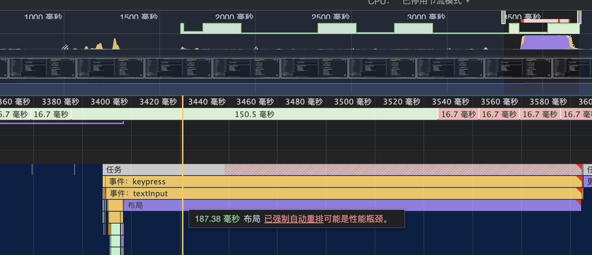
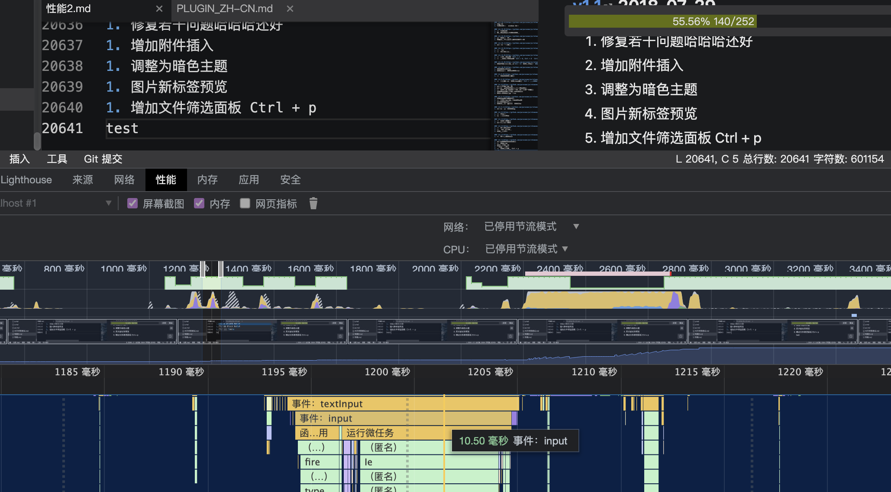

> [Yank Note](https://github.com/purocean/yn) 是我编写的一款面向程序员的笔记应用。这里我将会写下一些关于 Yank Note 的文章
> - [Yank Note 系列 01 - 为什么要自己写笔记软件？](/yank-note-01)
> - [Yank Note 系列 02 - Markdown 渲染性能优化之路](/yank-note-02)
> - [Yank Note 系列 03 - 同内存泄露的艰难战斗！](/yank-note-03)

## 前言

在 Yank Note 开发初期，基本没考虑过性能这方面的问题。后面因为一些性能问题影响到了交互体验，开始着手优化性能。

这里我将描述为性能优化所做的工作：

1. 引入虚拟 DOM
1. 延迟复杂内容渲染
1. 微调用户体验
1. 优化浏览器渲染

## 引入虚拟 DOM

Yank Note 采用 Markdown-it 做解析器。Markdown-it 默认使用 HTML 输出。因此在 Yank Note 3.0 以前，都是采用给渲染容器 innerHTML 直接赋值的方式来做渲染。

从上图可以看到，HTML 直出缺点很明显，每一次编辑文本，都要走一遍渲染流程，重新构建的 HTML。在每一次打字编辑的时候，都会造成页面重新布局，一些嵌入的功能如脑图、小工具也会重头渲染，导致页面闪烁，用户体验差。

所以这里需要想办法做增量渲染，即在编辑时候，只渲染变动部分。

考察了一些增量渲染方案，如 [markdown-it-incremental-dom](https://github.com/yhatt/markdown-it-incremental-dom)。因为本身这个项目使用 Vue，用 Vue 也能更好和 Vue 组件配合工作，所以后面决定使用 Vue 虚拟 DOM 的方式来做增量渲染。

### 收益

从交互角度，分为两个部分来讨论：

1. **首次渲染:** 打开一个新的文件，HTML 直出性能和 虚拟 DOM 相差不大，或许比虚拟 DOM 还好一些，毕竟省略了虚拟节点构造的流程。
1. **编辑渲染:** 编辑文件，生成的 Vue VNode 虚拟 DOM 来，后续的渲染均由 Vue 优化接管，做增量渲染，这一点就比 HTML 性能高了太多了。

增量渲染的好处不仅仅是在编辑时候有更高的渲染性能，也能更好的支持 Vue 组件，优化如脑图、HTML 小工具等的交互体验。

### 具体实现

**1. Token 流转换**

[在这个文件里](https://github.com/purocean/yn/blob/develop/src/renderer/plugins/markdown-render-vnode.ts)，我将 Markdown-it 默认的 HTML 渲染器，替换为了自己的渲染器。

Markdown-it parse 后产生的是 token 流而不是语法树，token nesting 属性表示层级关系（-1 关闭标签，0 自闭合，1 开标签）。

因此在 token 流遍历过程中，我构建了一个栈来把 token 流转换为 VNode 树。对于开标签和自闭合标签，产生一个新的 VNode 节点，开标签入栈；对于闭标签，出栈上一个 VNode。

这对于大部分的渲染场景是足够了。

**2. 插件兼容**

一些 Markdown-it 插件定义了渲染方法，会输出 HTML 字符串。自定义渲染器还是要能处理他们，不然就不能享受 Markdown-it 的生态优势了。

参考张鑫旭大牛的文章 [盘点HTML字符串转DOM的各种方法及细节](https://www.zhangxinxu.com/wordpress/2021/02/html-string-dom/comment-page-1/)，经过权衡还是选择了使用 innerHTML 的方法，足以覆盖大部分场景了。

**3. HTML 解析**

如果不进行 HTML 解析，那么上面的步骤是足够了。但是 Yank Note 作为一款异常开放的 Markdown 编辑器，怎么能不放开 HTML 渲染呢？

Markdown-it 解析器是支持 HTML 的，但是这些 HTML 根本就是原样输出的，也就说，Markdown-it 对于这些 HTML，从技术上都当作了普通文本一样，根本没解析成有结构的 token。

因此我参照原有得 HTML 解析器，写了一个新的 HTML 解析器。具体逻辑都在[这个文件里面](https://github.com/purocean/yn/blob/develop/src/renderer/plugins/markdown-html.ts)。

相比原有的全面 HTML 支持，这个解析器不能做到任意位置写 HTML，但是大部分情况下是可以满足了。

### 总结

引入虚拟 DOM，相当于对 Markdown-it 原有 render 做了一次大手术。一些特殊情况可能不能覆盖到，有问题的地方也能规避，总体来说收益较大。

## 延迟复杂内容渲染

**先主要关注首次渲染，即用户打开文件后，第一次将 Markdown 渲染出来的过程。**

我创建了一个性能测试文件，内容是Yank Note 的 Features 文档，复制粘贴后有 3600 行，渲染后有大量的复杂 Dom 结构。

我的电脑配置是 M1 芯片，8G 内存。再 dev 模式下开启应用，使用 Chrome 性能面板录制结果如下

简直太可怕了，从打开这个文件到展示出来竟然要 7 秒钟！

性能优化上，有这样一句话：“**你不能让计算机变得更快，你只能让它少做一点事**”。

但是在涉及用户体验的优化上，我自己也总结了一句话：“**如果你不能让计算机少做一点事，那么想办法让用户感知不到计算机正在做事**”。

所以我这里做的优化主要是把自定义的一些复杂功能如脑图，小工具，都延迟渲染，不要阻塞渲染主要内容。虽然后面可能会造成页面重新布局，但都是块元素的化这个问题会减轻很多。

优化后，能在一秒内展示出内容了。

## 微调用户体验

**这里主要关注编辑时，从用户输入文字到渲染的过程。**

编辑这一部分是 Monaco 编辑器做的事，本身 Monaco 就已经做得很好了，无需操心。

渲染这块，上面已经引入了虚拟 DOM。一般的文件没什么问题，从按键到渲染出来只需要几毫秒。Markdown 解析过程，一般来说 1 毫秒都用不到。

但是如果编辑一个超大的文件，这里的 Markdown 解析成本就不可忽略了。

再创建一个性能测试文件，内容是 Yank Note 的 Readme 文档，复制粘贴后有一万行。

看一下 Markdown 解析时间

解析这个一万行的文件，parse 过程都需要 100ms。

这个解析时间暂时我想不到什么办法来优化，所以那就优化用户体验吧。

未优化前，我是使用一个固定时间间隔的防抖方法来做渲染。在大文件中，这个防抖间隔就显得不够用了，打字非常卡。

那么就把渲染防抖函数的等待时间设置为动态的吧。记录 render 时间，然后动态更新 debounce 时间。小文件设置短一点，大文件长一点。在编辑大文件时，优先保证输入体验。

另外针对中文输入的情况，监听编辑器 composition 事件，在打字时候暂停渲染，这也能提升一部分的用户体验。

经过上面的处理和其他一些微调的优化后，在这个测试文件内打字，虽然还是有些卡顿，但情况好了不少。

## 优化浏览器渲染

我再次创建了一个两万行，60 万个字符的测试文件，编辑卡顿的情况进一步加剧了。

但是Yank Note 采用的是 Monaco 编辑器，理论上说文字编辑性能应该会和 VSCode 一致，然而我用 VScode 编辑这个两万行的文件，几乎没有卡顿，所以问题应当出现在我的代码上。

再次使用 Chrome 性能面板，排查问题。发现每一次按键后，浏览器花费了大量时间在布局上。

当我尝试用 Chrome 的层面板功能来看渲染时候，不幸的事情发生了，页面竟然崩溃了。可能页面元素太多，调试器扛不住了吧。

那就猜想一下造成重新布局的原因：整个应用的布局我是采用的 Flex 布局方式，每一次渲染要根据内容情况来计算整个页面的样式和布局。然而理论上渲染 Markdown 的位置和其他地方是无关的，因为所有的内容都在一个可滚动的盒子里。这个盒子的高度是不会随着渲染内容变化而变化，应该不存在重排的问题。

验证猜想，我把 Markdown 渲染容器设置为 100vh，不管输入打字或者更改窗口尺寸，都不会有问题了，那问题就一定是出在这上面。

所以优化方式就是将 Markdown 渲染容器定位设置为绝对定位，问题解决。现在在这个 2 万行，60万字符的文件里面打字，基本上和 VSCode 没什么两样了，更改窗口尺寸也不卡顿了。

## 进一步优化

上面的优化只是一些大的和容易的方面，还有一些不好优化的地方。

1. [markdown-it-attrs](https://github.com/arve0/markdown-it-attrs) 插件性能比较低，在渲染大文档时候花费了不少时间，看代码还有很大的优化空间
1. 尝试将解析 Markdown 的过程放入 worker 中，不阻塞主线程
1. 如有可能，尝试 Markdown 增量编译，即[只编译编辑的内容](https://github.com/markdown-it/markdown-it/issues/62#issuecomment-76346499)，但是这似乎不容易做到。

好了，上面就是我优化 Yank Note 渲染性能过程中的一些记录，如果你对 Yank Note 感兴趣，想使用或者参与贡献，可以到 [Github](https://github.com/purocean/yn) 了解更多。

> 本文由「[Yank Note - 一款面向程序员的 Markdown 笔记应用](https://github.com/purocean/yn)」撰写
