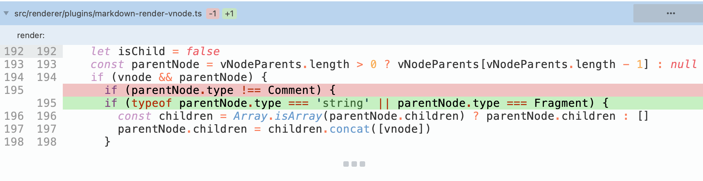
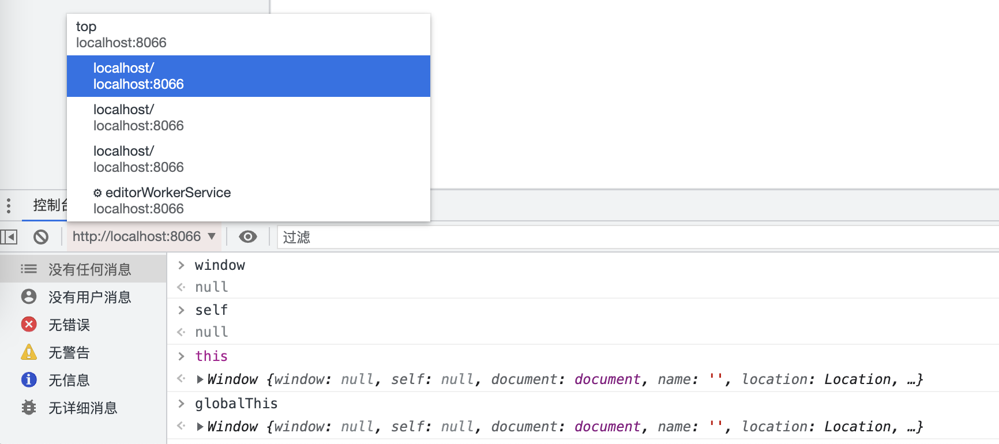
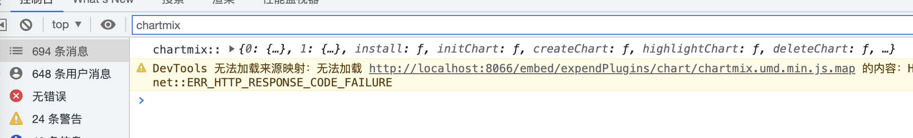
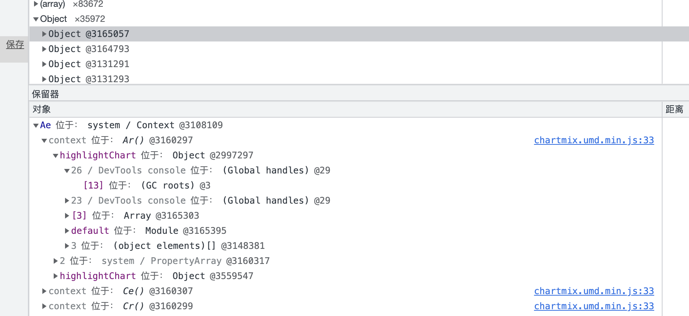

> [Yank Note](https://github.com/purocean/yn) 是我编写的一款面向程序员的笔记应用。这里我将会写下一些关于 Yank Note 的文章
> - [Yank Note 系列 01 - 为什么要自己写笔记软件？](/yank-note-01)
> - [Yank Note 系列 02 - Markdown 渲染性能优化之路](/yank-note-02)
> - [Yank Note 系列 03 - 同内存泄露的艰难战斗！](/yank-note-03)
> - [Yank Note 系列 04 - 编辑和预览同步滚动方案](/yank-note-04)

## 前言

在前一篇文章里，我讲述了给 Yank Note 做性能优化的一些事情。然而影响一个应用体验的，也不仅仅是性能，还包括功能是否满足用户需求、界面是否美观、交互操作是否合理流畅、运行是否稳定。

要保证应用稳定运行，除了 Bug 要少，内存占用也要尽量少和稳定。Yank Note 是 Web 技术开发的，通常的 Web 应用无需太关心内存占用，因为用户用完即走，实在卡顿了还能刷新页面解决。而 Yank Note 不一样，用户通常会一直打开应用，而现在的计算机通常也会很久都不关机，所以控制内存占用，减少内存泄露就成为 Yank Note 稳定运行必须要做的工作。

在 [v3.14.2](https://github.com/purocean/yn/releases/tag/v3.14.2) 版本，Yank Note 针对内存方面做了不少优化，本文将描述在解决内存泄露过程中所做的事情。

## 实验方式和排查工具

### 实验场景

Yank Note 在使用过程中，用户会进行较多的文字输入，也会进行文档切换。两个场景是潜在内存泄露的重点关注地方。

得益于 Yank Note 开放的 Api，我只需要写几句脚本，即可在真实应用中模拟上面两个操作。

**渲染脚本：模拟文本输入后的渲染**
```js
for (let i = 0; i < 100; i ++) {
  ctx.view.render();
  await ctx.utils.sleep(50);
}
```

**文档切换脚本：模拟文档切换**
```js
for (let i = 0; i < 30; i ++) {
  await ctx.doc.showHelp('FEATURES.md');
  await ctx.utils.sleep(1000);
  await ctx.doc.showHelp('README.md');
  await ctx.utils.sleep(2000);
}
```

### 工具

使用 Chrome 隐私标签，排除插件干扰。用到了 Chrome 的性能监视器面板，内存面板，性能面板。

### 过程

运行模拟脚本，使用 Chrome 性能监视器查看内存增长曲线，配合内存快照功能，查找出内存泄露点。

## Vue 虚拟节点内存泄露

在运行完渲染脚本后，发现内存有不少增长。这意味着，用户在正常打字输入后，系统使用的内存也会慢慢升高。

排查下来，发现了问题的关键：在代码里面使用 `h('div')` 不会有内存泄露，然而使用 `h(CustomComponent)` 则会产生泄露。

在上一篇文章里，为了优化渲染性能，Yank Note 引入了 Vue 的 VNode，效果很不错。每一个元素，都是新创建的VNode。但是对于自定义函数式组件，都是使用的最初创建的组件，我的代码会追加 children 而不是替换，所以造成了内存泄露。

而自定义组件的 children 现阶段没任何用处，所以解决办法就是判断 VNode type 类型，type 是 string 和 fragment 节点才塞入 children。

而自定义组件的 children 现阶段没任何用处，所以解决办法就是判断 VNode type 类型，type 是 string 和 fragment 节点才塞入 children。



## 百度脑图组件内存泄露

我使用百度的 [kityminder-core](https://github.com/fex-team/kityminder-core) 来做脑图的可视化。

这个库最初应该只是服务自家的脑图服务，基本上只考虑了一个页面只有单实例，因此它在事件监听和全局资源的使用上很随性。虽然脑体实例提供了一个 destroy 方法，但调用后抛错，Hack 了一下后能跑完流程，但很多事件还是没取消监听，全局变量使用也没释放。

### 解决事件监听

kityminder 所有的全局 DOM 事件监听都是发生在 new 这个类的时候。所以我干脆在 new 这个类之前重写 `window.addEventListener` 记录监听了哪些方法，然后销毁时候手动取消监听

```js
const realAddEventListener = window.addEventListener.bind(window)
const events: {type: string, listener: any}[] = []
window.addEventListener = (type: string, listener: any) => {
  logger.debug('hack addEventListener', type)
  events.push({ type, listener })
  realAddEventListener(type, listener)
}

const km = new window.kityminder.Minder()

// 恢复原来的事件监听
window.addEventListener = realAddEventListener

// 销毁调用
events.forEach(({ type, listener }) => {
  window.removeEventListener(type, listener)
})

```

### 解决全局变量使用

kityminder 内部使用的是 kity 这个库，也是百度出品。这个库将很多内部事件都绑定在了原型上，也没有回收资源的地方。而且 Yank Note 可能会在页面上嵌入多个脑图实例，因此粗暴的消灭掉这些全局变量使用也不现实。

所以我借鉴了微前端的思想，那就在每次 new 类的时候，都使用全新的一个类吧。动了一下 kity 的源码，把模块导函数暴露出来。

```js
Object.defineProperty(window, 'kity', {
  get: () => {
    logger.debug('new kity')
    return window.kityM()
  },
})

Object.defineProperty(window, 'kityminder', {
  get: () => {
    logger.debug('new kityminder')
    return window.kityminderM()
  },
})
```

每一次 new 类的时候，都重新调用模块的初始化方法创建一个新的类。虽然初始化效率比共用一个类低了一些，但也比 iframe 的方式效率高。

## 日志打印优化

在运行文档切换脚本后，内存占用迅速飙升，一度达到快 1G，非常吓人。打快照出来后，发现泄露点是在 Luckysheet 功能。

但是 Luckysheet 我是通过 iframe 引入的，按理说 iframe 销毁后，内部的所有资源当释放呀，怎么内存还没释放？而且更为要命的是，刷新页面之后，这些内存也不会销毁！这就让我很疑惑了，难不成遇到了 Chrome 的 Bug ？

仔细观察堆快照，发现有很多 Detached Window，这些都是 Lucksheet 使用过的 iframe。在控制台你甚至还可以进入这个 Window，看到 this 和 globalThis 没有被清理。难不成真的是 Chrome 的 Bug ？



后面又做了不少实验，发现也只有 Luckysheet 这个 iframe 会有这种情况，其他 iframe 都不会。那么肯定是 Luckysheet 和其他有什么不同导致的。

终于，我发现了，Luckysheet 会在控制台打印对象日志，而其他 iframe 不会！而这就是罪魁祸首！



其实最开始在排查时候，我就看到了 Devtools console 的字样，但是因为它除了这一个地方还有其他挂载引用，所以我一时没往这方面想。



至于为什么刷新页面后，内存依然不被释放，我猜想应该是 Chrome 控制台有个保留日志的功能，也就是刷新页面后，日志依然可以展示，如果要支持这个功能，那么不释放内存也在情理之中了。

解决办法：嵌入 iframe 在生产环境关闭日志打印，通过重写 console 的方式实现。

```js
console.warn = () => 0
console.log = () => 0
console.info = () => 0
console.dir = () => 0
```

经过了上面的处理后，运行切换文档脚本后，内存基本不再增长了。

结论：技术水平不够的时候，**不要随便怀疑浏览器**；尽量不要在日志中打印具有多层引用的对象，生产环境关闭日志打印。

## 其他

使用 Chrome 的内存工具还查找出来了其他几处内存泄露，基本都是和闭包的使用有关，这里就不多描述了。

## 总结

做了上面的工作之后，整个应用的内存使用情况好了很多。反复切换复杂文档后，Javascript 堆内存使用也能维持在合理水平。

在开发过程中，需要注意合理使用闭包，使用第三方库也需要考察否满足性能和内存使用需求。

如果你对 Yank Note 感兴趣，想使用或者参与贡献，可以到 [Github](https://github.com/purocean/yn) 了解更多。

> 本文由「[Yank Note - 一款面向程序员的 Markdown 笔记应用](https://github.com/purocean/yn)」撰写
