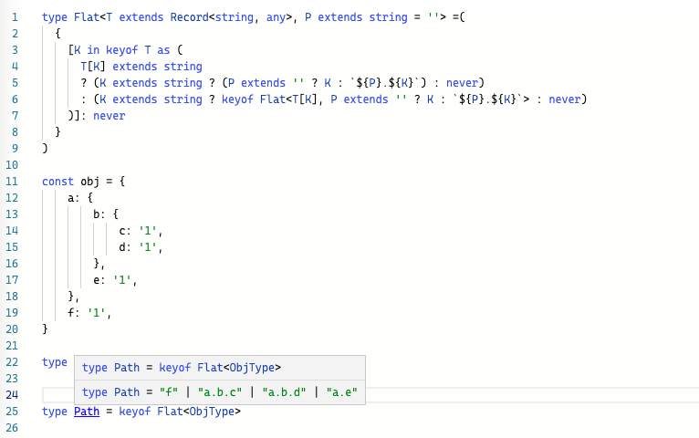

Lodash 的 [`_.get`](https://lodash.com/docs/4.17.15#get) 方法可以使用路径字符串从一个对象中取值。现在我们想给这个路径参数做上类型限制。

这里只展示核心类型，用运算递归来实现。

```ts
type Flat<T extends Record<string, any>, P extends string = ''> =(
  {
    [K in keyof T as (
      T[K] extends string
      ? (K extends string ? (P extends '' ? K : `${P}.${K}`) : never)
      : (K extends string ? keyof Flat<T[K], P extends '' ? K : `${P}.${K}`> : never)
    )]: never
  }
)

const obj = {
    a: {
        b: {
            c: '1',
            d: '1',
        },
        e: '1',
    },
    f: '1',
}

type ObjType = typeof obj

type Path = keyof Flat<ObjType>

```


[在线体验](https://www.typescriptlang.org/play?ts=4.3.5#code/C4TwDgpgBAYgNgQ2AHgCpQgD2BAdgEwGcoAlCAYwHsAnfZQ4agS1wHMAaKBXEAPk4AKGbHiJQGzNlAC8UAORzeMgBQAoKFADe6jVADaAaSgsoAawghKAMyjoExNbt2pDAXWE4CxCS1Y6nAPxQykZYnmI+UkHKQmGixApQQUYAXFAABgAkmgIAvgB02Qa56QCUUGm4EABuENSl-rppIR7x4oy+SWYW1rCIKC4GroKtXvJyXakZ2XmFmsXpSpU1dQ1Opa7LtdQ6uaoNqlS4DFCUAEYAVjJajQhp2k5OZ-eNj7rkaXIAjHLsr29QfCfH5-AFQXKggEQYG-RoQxpWGF-PaqUCQKAAeUuqHA0FkaIgvXOF1UpIJUAESAAFtdzJYbPAkMgsRccZBeKogA)



> 本文由「[Yank Note - 一款面向程序员的 Markdown 笔记应用](https://github.com/purocean/yn)」撰写
