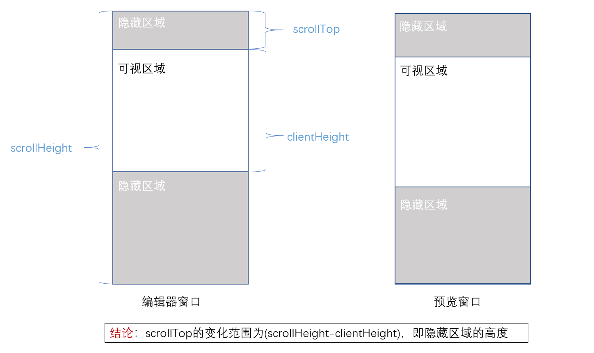
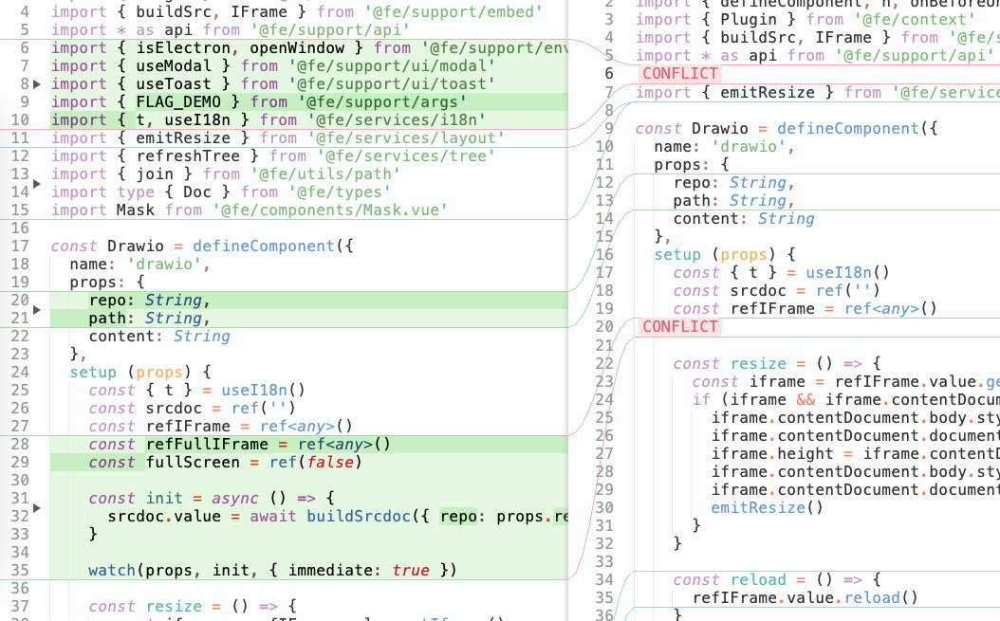

> [Yank Note](https://github.com/purocean/yn) 是我编写的一款面向程序员的笔记应用。这里我将会写下一些关于 Yank Note 的文章
> - [Yank Note 系列 01 - 为什么要自己写笔记软件？](/yank-note-01)
> - [Yank Note 系列 02 - Markdown 渲染性能优化之路](/yank-note-02)
> - [Yank Note 系列 03 - 同内存泄露的艰难战斗！](/yank-note-03)
> - [Yank Note 系列 04 - 编辑和预览同步滚动方案](/yank-note-04)
> - [Yank Note 系列 05 - 关于本地历史功能](/yank-note-05)

Yank Note 实现了从源码到预览的单向同步滚动。研究了一些同步滚动方案，大体分为下面三种。

## 行号匹配

Yank Note 最初就是采用的这种方案，简单直接，前提是渲染出的 Dom 节点需要包含行号信息。

1. 监听编辑器可视区域变化/滚动事件，获取顶部的行号
2. 拿着行号找到对应行号的 Dom 元素
3. 调用 Dom 元素的 `scrollIntoView` 方法

这个方案优点是比较精准，缺点是行号匹配不到时候滚动不太好，也不够平滑。

## 等比例滚动

这个方案就是不管行号匹配，直接按照编辑器滚动高度和可视区域滚动高度来等比例设定滚动条位置。

这个方案优点是不用计算行号，适合 textarea 做编辑器的场景，滚动也比较平滑。缺点则是滚动不太精准，特别是有图片的时候。

## 综合方案

### 根据标题做等比例滚动

掘金的 Markdown 编辑器是使用的字节的 [Bytemd](https://github.com/bytedance/bytemd) 编辑器。

每次编辑器滚动，标题到顶时候，始终保证标题元素是平齐的。也就是两个标题之间的滚动做等比例滚动。

优点是滚动非常平滑，也兼顾了一部分滚动精确性，只能精确到标题。

### 行号匹配和等比例结合

[Markdown-it Demo](https://markdown-it.github.io/) 是用的这种算法。

在**行号匹配**的基础上：

- 如果能找到对应行号的 Dom 元素，直接将对应 Dom 元素滚动到可视区域顶部。
- 如果不能找到对应行号的 Dom 元素，那就获取该行号的上一个 Dom 元素 和下一个 Dom 元素。直接根据行号偏移做等比例滚动。

这个方案对很多行源码生成一个比较高的元素，如围栏和代码块等，效果较好。对单行元素生成较高的元素如图片则效果还是差一点（比直接行号匹配强）。

因为 Yank Note 里这种场景比较多（Mermaid 图形、脑图、HTML 小工具等），滚动平滑度我个人觉得不是那么重要，所以最终采用了这个方案。

## 进一步

在使用 Sublime Merge 的过程中，我发现它的解决冲突界面，同步滚动做得比较符合我的预期。这种交互我觉得可以再研究一下，看能不能作为 Markdown 编辑和预览同步滚动的另一种方法。

## 参考

1. [markdown编辑与预览窗口同步算法 - 少年小白 - 博客园](https://www.cnblogs.com/so-easy/p/12154477.html)
2. [markdown-it.github.io/index.js at master](https://github.com/markdown-it/markdown-it.github.io/blob/master/index.js#L13419)
3. [bytemd/editor.svelte at main](https://github.com/bytedance/bytemd/blob/main/packages/bytemd/src/editor.svelte#L262)

如果你对 Yank Note 感兴趣，想使用或者参与贡献，可以到 [Github](https://github.com/purocean/yn) 了解更多。

> 本文由「[Yank Note - 一款面向程序员的 Markdown 笔记应用](https://github.com/purocean/yn)」撰写
