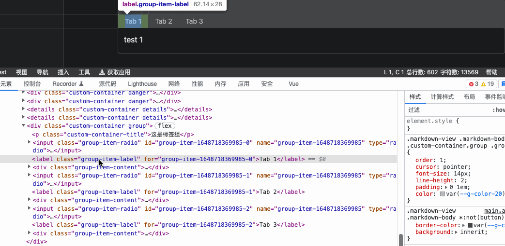

之前看张鑫旭大神的文章

- [无JavaScript纯CSS实现选项卡轮转切换效果 &laquo;  张鑫旭-鑫空间-鑫生活](https://www.zhangxinxu.com/wordpress/2010/09/%E6%97%A0javascript%E5%AE%9E%E7%8E%B0%E9%80%89%E9%A1%B9%E5%8D%A1%E8%BD%AE%E8%BD%AC%E5%88%87%E6%8D%A2%E6%95%88%E6%9E%9C/)
- [CSS radio/checkbox单复选框元素显隐技术 &laquo;  张鑫旭-鑫空间-鑫生活](https://www.zhangxinxu.com/wordpress/2012/01/css-css3-selector-element-display-tab-listdown/)

不用 JS 实现选项卡切换效果。文中有两种实现方式：锚点实现和 radio 单选框实现。

锚点实现的方式会导致页面跳转且会更改页面路径，基本没有什么能用到的地方。用 redio 的方式也的文章发布在 2012 年以前，比较久远。所以原示例使用 float 来排布 tab，只能固定高度，不能实现高度自适应。

而现在我们可以使用 flex 加 order 属性，避免 float 高度塌陷的问题，实现高度自适应，实现一个比较完美的选项卡切换。[Yank Note](https://github.com/purocean/yn) 的[自定义 Group 容器](https://github.com/purocean/yn/blob/develop/src/renderer/plugins/markdown-container.ts)便采用这种纯 CSS 的方式实现。

为什么这里我要使用 CSS 而不是 JS 来实现呢？一是因为 Markdown-it 是顺序解析并渲染的，如果要做成树状的结构，那么需要回溯，要做很多额外的动作；二是引入 JS 后，这个文档如果导出成不带 JS 的 HTML 便不能工作了；最后呢则还是有点炫技的意味在里面。我个人来说，[能用 CSS 实现的我就不愿意动用 JS](https://www.zhihu.com/question/41679942/answer/107752907)

> 本文由「[Yank Note - 一款面向程序员的 Markdown 笔记应用](https://github.com/purocean/yn)」撰写
