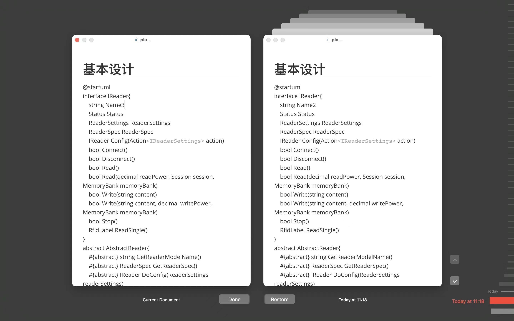
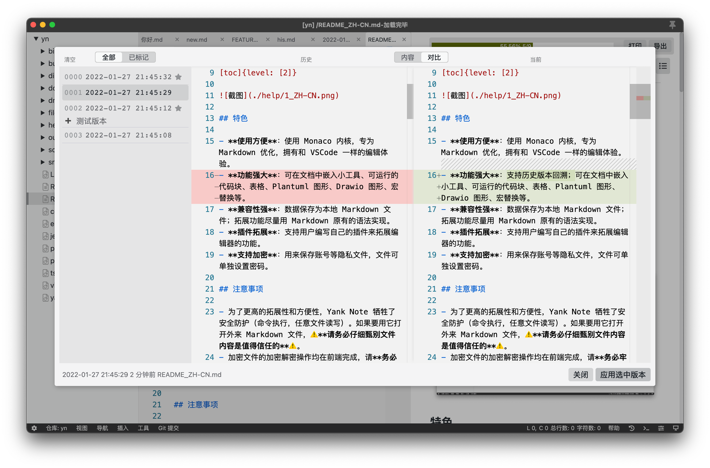

> [Yank Note](https://github.com/purocean/yn) 是我编写的一款面向程序员的笔记应用。这里我将会写下一些关于 Yank Note 的文章
> - [Yank Note 系列 01 - 为什么要自己写笔记软件？](/yank-note-01)
> - [Yank Note 系列 02 - Markdown 渲染性能优化之路](/yank-note-02)
> - [Yank Note 系列 03 - 同内存泄露的艰难战斗！](/yank-note-03)
> - [Yank Note 系列 04 - 编辑和预览同步滚动方案](/yank-note-04)
> - [Yank Note 系列 05 - 关于本地历史功能](/yank-note-05)
> - [Yank Note 系列 06 - 使用人工智能写文章是什么体验？](/yank-note-06)

昨天更新 VSCode，发现 VSCode 也增加了保留文件本地历史功能。回想起前不久为了给 Yank Note 增加历史记录功能，抠破了脑袋，构思了好久历史记录储存策略。感叹要是 VSCode 早发布几个月，我还能有个参考。

不过当我看了 VSCode 的历史储存策略后：这么粗暴？

## VSCode 的策略

VSCode 1.66 版本的时间轴中可以展示文件本地历史了，效果是这样

针对这个功能，VSCode 也增加了一些配置:

>There are also new settings to work with local history:
>
> + `workbench.localHistory.enabled` \- Enable or disable local history (default: `true`).
> + `workbench.localHistory.maxFileSize` \- File size limit when creating a local history entry (default: `256 KB`).
> + `workbench.localHistory.maxFileEntries` \- Local history entries limit per file (default: `50`).
> + `workbench.localHistory.exclude` \- Glob patterns for excluding certain files from local history.
> + `workbench.localHistory.mergeWindow` \- Interval in seconds during which further changes are added to the last entry in local file history (default `10s`).

右键点击历史条目，有菜单可以直接在系统管理器中找到文件某个历史记录的副本。

因此可以推断出，VSCode 为每一个保存/撤销等操作，在一定时间窗口（默认10s）内，保存一个文件到文件夹。通过特殊的文件命名（保留时间信息）来定位历史记录。

这也太粗暴了，一个文件就是一个版本呗。

## Typora 的策略

然后说下当时调研的 Typora 的策略。Typora 在 macOS 上有非常精美的文件历史回溯界面

看样子它应该是用的系统的“时间机器”来实现版本回溯的。所以这个功能在 Windows 上也就没有了。

## Yank Note 的策略

我设想中的历史版本，有几个目标：

1. 最重要的目标是尽量避免数据丢失。
2. 历史记录不要占用太多体积，最好能增量记录。
3. 极端情况下要方便用户还原数据。
4. 历史记录应该可以标记和备注

针对第一个目标，我希望能保留用户最近的编辑版本，不要舍弃。而 Yank Note 有自动保存功能，也就有了第二个目标，不要占用太多空间，也不要生成太多文件。所以最开始想的类似 VSCode 那种，时间窗口+文件保存的策略，就不行了。

针对第三个目标，我不想引入自定义的格式，如 Git，或者数据库。因为如果用户丢失了数据，在软件也不方便找到历史记录的情况（软件损坏，文件误删等），用户要可以进入历史目录，把文件找回来。

> 后续：有个用户误删了一个文档，回收站也找不到了，就通过这种方法恢复的。

再考虑第四个目标，最终我选择了使用 zip 文件的方式来保存文件历史版本，虽然在写入和读取历史上会消耗一点计算性能（10多兆大文件历史记录也基本没感知），但最终效果还是很好的。

最终策略：

1. 每个文档由文件名和路径 Hash 拼出一个 zip 包文件名
2. 每次写入文件，同时往这个 zip 文件中写入一个新版本文件
3. 移动和重命名文件时候同步更改 zip 文件的名字
4. 最大历史版本数可以做一个限制。
5. 版本备注和标记信息可以存在压缩的备注字段中。

通常编辑一个文件的时候，由于自动保存的机制，当前版本和上一个版本之间的差异很小，因此理论上往压缩文件中添加一个新的版本文件，压缩文件整体大小增加应该很小才对。不过后来发现并非如此，这时我才意识到 Zip 文件压缩的特性：每个文件分别压缩，再合起来打包。也即是说往压缩包新增文件的时候，并不会和其他文件一起压缩。

针对这种情况，我采取两次压缩的策略：第一次把压缩率设置为 0，仅仅打包，这样 zip 包内都是文件的原始信息。第二次将整个打包文件压缩一次，这下压缩程序就可以考虑整体的信息来做压缩了，这就实现了“增量更新”的目的。

后面编写脚本测试，一个普通长度的文件，保存 1000 个版本，也才占用 50KB。

使用了几个月下来，我的历史文件目录也才占用 700 多 KB 的空间，里面大部分历史记录文件只有几 KB 大小。反观 VSCode，使用这两天历史目录就占用了 2M。

## 进一步

针对历史储存，我还进一步想了一些保存策略

> 相对于最后一次保存时间，保留：
>
> - 过去10分钟内的每一个版本
> - 过去1小时内每分钟一个版本
> - 过去24小时每小时一个版本
> - 每日保留一个版本
> - 已标记的备份

不过目前看来是不需要了，目前的策略简单，各方面也达到我的预期了。

> 本文由「[Yank Note - 一款面向程序员的 Markdown 笔记应用](https://github.com/purocean/yn)」撰写
