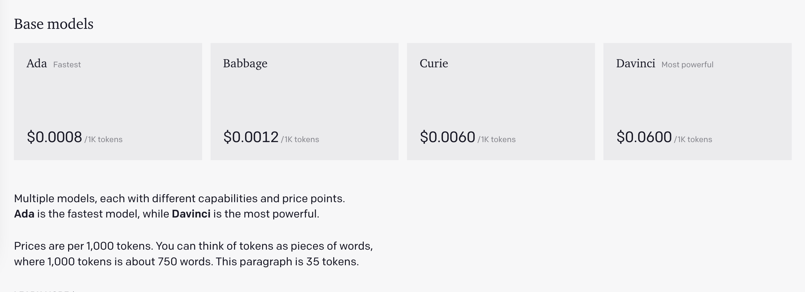
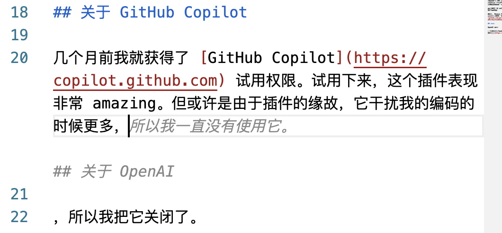

> [Yank Note](https://github.com/purocean/yn) 是我编写的一款面向程序员的笔记应用。这里我将会写下一些关于 Yank Note 的文章
> - [Yank Note 系列 01 - 为什么要自己写笔记软件？](/yank-note-01)
> - [Yank Note 系列 02 - Markdown 渲染性能优化之路](/yank-note-02)
> - [Yank Note 系列 03 - 同内存泄露的艰难战斗！](/yank-note-03)
> - [Yank Note 系列 04 - 编辑和预览同步滚动方案](/yank-note-04)
> - [Yank Note 系列 05 - 关于本地历史功能](/yank-note-05)
> - [Yank Note 系列 06 - 使用人工智能写文章是什么体验？](/yank-note-06)
> - [Yank Note 系列 07 - 性能暴增 67 倍的秘密——重写](/yank-note-07)

## 关于 GitHub Copilot

几个月前我就获得了 [GitHub Copilot](https://copilot.github.com) 试用权限。试用下来，这个插件表现非常 Amazing。但或许是由于插件的缘故，它干扰我的编码的时候更多，所以我一直没有使用它。

最近一段时间 GitHub 放开了更多测试。我再次使用，发现体验好了很多，不少时候自动提示超出了我的期望，完全可用，另一些时候虽然提示的和想要的有差距，但是也有一些参考意义。

总之我用它来：

- 补全代码，不少时候自动提示的代码还是很有参考价值甚至可以直接用
- 根据注释写示例代码，这样就省去了查 API 文档的时间
- 根据代码补全注释，帮助我措辞
- 翻译文本，Copilot 可以根据上下文翻译正确的语言

不仅是代码，在 Markdown 文件中，Copilot 表现也不错。写一个项目的说明文档的时候，他完全可以根据上下文了解到我试图写什么，给出合理的建议。

然后，我突然想到能不能在 Yank Note 中也把它用起来？

那就先看看 Github Copilot 是怎么实现的吧。

## 关于 OpenAI

Github Copilot 是基于 [OpenAI Codex](https://copilot.github.com/#faq-what-is-github-copilot)实现的。

OpenAI 在 前两年发布了 GPT-3 模型。这个模型刚出来时候，简直是毁三观的存在。1750亿参数，训练成本就达到了 1200 万美元。

或许是因为这样，OpenAI 商用后，价格也是相当贵。

看上面的价格表，不同模型有不同的价格和效果。如果按照最贵情况调用，请求一次恐怕要支付上一块钱人民币。

后面看了一下我的 OpenAI 接口使用情况，大概调用了 40 次，就花了 1.88 美元。这实在是太贵了。所以别看现在 Github Copilot 免费，指不定后面哪天收费，那也在情理之中。且用且珍惜。

## Yank Note 中的 OpenAI

先上最终效果：

<video src="./FILES/2022-04-10-yank-note-06.md/openai.mp4" height="200" controls></video>

表现是相当 Amazing 呀。本文也有部分是这个 AI 提示生成的。接口 `max_tokens` 配置小一点，针对句子写到一半要思考怎样措辞情况，非常有用。

因为 OpenAI 的接口太贵，所以我开始想着是不是能直接把 Copilot 接口搞来自己用用。

研究了一下 Copilot VSCode 插件，它的代码是混淆过的。美化后打日志粗略看了一下，还有很多 WebAssembly 代码调用，一些签名啥的，大概率不好整。

那就算了吧，还是回头看看 OpenAI 的接口。不过立马一句 “OpenAI's API is not available in your country” 就拦住了去路。好不容易注册后，还要国外的手机号认证。不过好在最后还是搞定了。

新用户有 18 美元的免费额度，在 Playground 试了一下，真厉害。

得益于 Monaco 编辑器开放的 API 和 Yank Note 的插件机制，实现这一切仅仅花了几小时，[一百来行代码](https://github.com/purocean/yn/commit/a01f2bc5fa4055ee803438a047a7011fab42c762)。

## 其他

- 针对 Markdowon 文件，Yank Note 的 OpenAI 和 Github Copilot 的补全还是有不少差异。应该是 GPT-3 和 Codex 还是不一样。另外就是Copilot 里面不太容易触发长段的文字。
- 后续可以优化下针对光标不同位置微调参数，但现阶段意义应该不大，毕竟 OpenAI 又贵又不 “Open”（中国地区不能用）。现在只能当作玩具。
- 看了一下国内几家云服务商的人工智能产品，好像还找不到能和 OpenAI GPT-3 模型相比的自然语言处理产品，希望未来能有一些便宜的吧。

> 本文由「[Yank Note - 一款面向程序员的 Markdown 笔记应用](https://github.com/purocean/yn)」撰写
