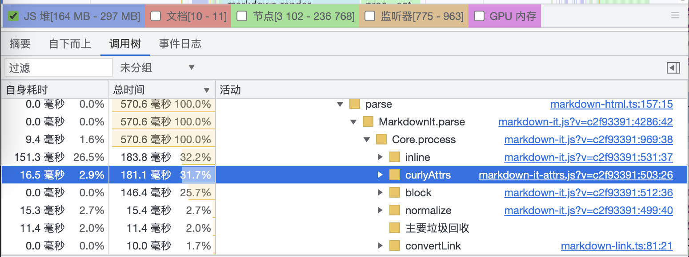
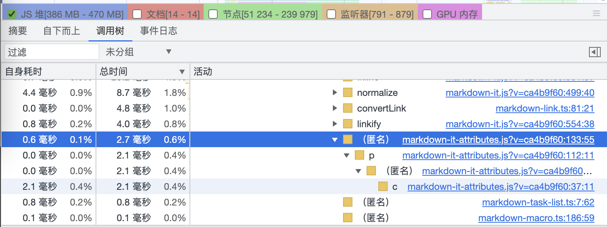

> [Yank Note](https://github.com/purocean/yn) 是我编写的一款面向程序员的笔记应用。这里我将会写下一些关于 Yank Note 的文章
> - [Yank Note 系列 01 - 为什么要自己写笔记软件？](/yank-note-01)
> - [Yank Note 系列 02 - Markdown 渲染性能优化之路](/yank-note-02)
> - [Yank Note 系列 03 - 同内存泄露的艰难战斗！](/yank-note-03)
> - [Yank Note 系列 04 - 编辑和预览同步滚动方案](/yank-note-04)
> - [Yank Note 系列 05 - 关于本地历史功能](/yank-note-05)
> - [Yank Note 系列 06 - 使用人工智能写文章是什么体验？](/yank-note-06)
> - [Yank Note 系列 07 - 性能暴增 67 倍的秘密——重写](/yank-note-07)

在之前的文章 [Yank Note 系列 02 - Markdown 渲染性能优化之路](/yank-note-07) 中，我描述了为了优化性能而做的努力。不过心里一直有个疙瘩就是文后提到的 [markdown-it-attrs](https://github.com/arve0/markdown-it-attrs) 插件性能还是较低。

这个插件我很早就用上了，Yank Note 有不少功能也依赖它。之前也尝试找过类似的插件，都没看到有合适的。

周末天气很冷，要不再看看这个问题吧。

## 重写

Fork 了原作者的代码，发现比较难优化。如下面两行代码复杂度就比较高。

```js
function isArrayOfObjects(arr) {
  return Array.isArray(arr) && arr.length && arr.every(i => typeof i === 'object');
}

function isArrayOfFunctions(arr) {
  return Array.isArray(arr) && arr.length && arr.every(i => typeof i === 'function');
}
```

我尝试给它们加上缓存，提升也不大。

而且他的代码写得比较绕，他用了一堆配置规则来处理 [markdown-it](https://github.com/markdown-it/markdown-it) 生成的所有 Token。这些规则写得感觉也很复杂。还用 splice 方法操作了 tokens 数组，这也是有一些性能损耗。

于是我决定还是重写吧。仓库: [markdown-it-attributes](https://github.com/purocean/markdown-it-attributes)

原作者的仓库有不少测试用例，这给我的重写工作带来了很多便利，很快这个工作就完成得差不多了。

## 测试

使用一个 100000 行, 350000 个字符的大文件测试一下

**markdown-it-attrs**


**markdown-it-attributes**


**调用时间由原来的 181ms 降低到 2.7ms!**

搞个 benchmark 文件测一下实际渲染，提升也是非常大。

```
node benchmark.js

markdown-it-attrs test1: 1897ms
markdown-it-attributes test1: 532ms
result equal: true
```

## 一点经验

要写出性能还过得去的代码，一定牢记准则 “**你不能让计算机变得更快，你只能让它少做一点事**”

0. 使用性能评估工具测量代码
1. 了解内置方法复杂度如 `Array.splice` 也可能会很消耗性能
2. 使用正则表达式也要谨慎评估可能的复杂度，当心 *ReDoS*。很久以前给腾讯云提交了一个这种类型的漏洞，一个简单的请求可以让服务器持续运行很久甚至挂掉。
3. 少一些动态操作，方便 JS 引擎优化
4. 常见的逻辑或开销小的逻辑放前面。如 `if (flag && arr.some(x => !!x))` 就比 `if (arr.some(x => !!x) && flag)` 好。
5. 考虑代码是否会频繁触发垃圾回收
6. 可以加一些适当的缓存

> 本文由「[Yank Note - 一款面向程序员的 Markdown 笔记应用](https://github.com/purocean/yn)」撰写
