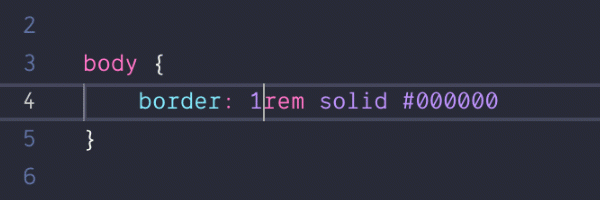
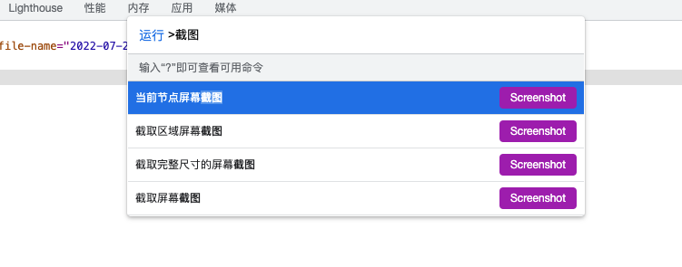

这里我将写下我的电脑上面（macOS）的一些软件和工具，以及一些使用技巧（不定时更新）。

囿于丐版 MacBook Pro 孱弱的性能，下面的工具都是经过我筛选过的，只留下真正有用的部分。也不是所有的都列上，一些大家常用的就不列了。

## 应用

1. [Clipy: Clipboard extension app for macOS.](https://github.com/Clipy/Clipy)
    一款剪切板和文本片段工具
1. [FileZilla](https://filezilla-project.org/)
    FTP 工具
1. [Image2Icon](https://apps.apple.com/us/app/image2icon-make-your-icons/id992115977?mt=12)
    把图片转换为图标的工具
1. [Keka](https://www.keka.io/en/)
    压缩解压文件软件
1. [LICEcap](https://www.cockos.com/licecap/)
    录屏为 Gif 的工具
1. [Microsoft Remote Desktop Beta](https://apps.apple.com/app/microsoft-remote-desktop/id1295203466?mt=12)
    微软官方的远程桌面工具
1. [Optimage](https://optimage.app/)
    图片压缩工具
1. [Pomy](https://apps.apple.com/us/app/pomy/id1422640635?mt=12)
    一款倒计时工具
1. [ZeroTier One](https://www.zerotier.com/)
    一款组建私人局域网的工具
1. [Yank Note](https://github.com/purocean/yn)
    我自己开发的 Markdown 笔记软件。这个软件里面我也写了不少[小工具](https://github.com/purocean/yn/issues/65#issuecomment-962471626)

## VSCode插件

1. [Bookmarks](https://marketplace.visualstudio.com/items?itemName=alefragnani.Bookmarks)
    在项目中添加书签，方便跳转
1. [change-case](https://marketplace.visualstudio.com/items?itemName=wmaurer.change-case)
    快速改变文本大小写形式，支持多种形式
1. [Code Spell Checker](https://marketplace.visualstudio.com/items?itemName=streetsidesoftware.code-spell-checker)
    拼写检查工具，能正确识别驼峰或下划线的形式
1. [Color Highlight](https://marketplace.visualstudio.com/items?itemName=naumovs.color-highlight)
    高亮代码中的颜色字符串
1. [EditorConfig for VS Code](https://marketplace.visualstudio.com/items?itemName=EditorConfig.EditorConfig)
    统一项目的文本风格，如缩进，行末空白，文件末尾空行等
1. [File Utils](https://marketplace.visualstudio.com/items?itemName=sleistner.vscode-fileutils)
    文件工具集 A convenient way of creating, duplicating, moving, renaming, deleting files and directories.
1. [GitHub Copilot](https://marketplace.visualstudio.com/items?itemName=GitHub.copilot)
    人工智能写代码
1. [GitLens — Git supercharged](https://marketplace.visualstudio.com/items?itemName=eamodio.gitlens)
    Git 增强
1. [Incrementor](https://marketplace.visualstudio.com/items?itemName=nmsmith89.incrementor)
    使用快捷键快速改变数字
1. [Path Intellisense](https://marketplace.visualstudio.com/items?itemName=christian-kohler.path-intellisense)
    文件路径补全
1. [Sublime Merge for VSCode](https://marketplace.visualstudio.com/items?itemName=giovdk21.vscode-sublime-merge)
    快速唤起 Sublime Merge，以便查看当前文件/行的历史
1. [Toggle Quotes](https://marketplace.visualstudio.com/items?itemName=BriteSnow.vscode-toggle-quotes)
    使用快捷键快速切换引号形式 Toggle cycle " -> ' -> `

## 浏览器

下面的操作均用于 Chrome 浏览器

1. JavaScript Bookmarklet 书签
    
    Chrome 支持在书签中嵌入 JavaScript 代码，可以很方便的运行一些常用的脚本。[可参考这里添加](https://www.cnblogs.com/wangqiideal/p/10083993.html)。

    1. 获取选中文字字数，不用一个一个数啦
        ```js
        javascript:alert(window.getSelection().toString().length);
        ```
    2. 编辑网页，改网页内容截图很方便，比 PS 还好用
        ```js
        javascript:document.body.contentEditable=true
        ```
    3. 拷贝域名，从地址栏复制域名有点难选，这个点一下就成，很方便
        ```js
        javascript:(function(){function executeCopy(text) {    var input = document.createElement('textarea');document.body.appendChild(input);input.value = text;input.focus();input.select();document.execCommand('Copy');input.remove();}executeCopy(window.location.hostname); })();
        ```
2. 浏览器插件
    1. [Imagus - Chrome Web Store](https://chrome.google.com/webstore/detail/imagus/immpkjjlgappgfkkfieppnmlhakdmaab)
        强烈推荐，鼠标悬停即可查看大图，非常方便
    1. [Wappalyzer - Technology profiler - Chrome Web Store](https://chrome.google.com/webstore/detail/wappalyzer-technology-pro/gppongmhjkpfnbhagpmjfkannfbllamg)
        嗅探当前网站是采用了什么技术。
    1. [Vue.js devtools - Chrome Web Store](https://chrome.google.com/webstore/detail/vuejs-devtools/nhdogjmejiglipccpnnnanhbledajbpd)
        Vue 开发工具，必装
    1. [React Developer Tools - Chrome Web Store](https://chrome.google.com/webstore/detail/react-developer-tools/fmkadmapgofadopljbjfkapdkoienihi)
        React 开发工具
    1. [Vimium - Chrome Web Store](https://chrome.google.com/webstore/detail/vimium/dbepggeogbaibhgnhhndojpepiihcmeb)
        用键盘浏览网页
    1. [uBlock Origin - Chrome Web Store](https://chrome.google.com/webstore/detail/ublock-origin/cjpalhdlnbpafiamejdnhcphjbkeiagm)
        广告过滤
    1. [Tampermonkey - Chrome Web Store](https://chrome.google.com/webstore/detail/tampermonkey/dhdgffkkebhmkfjojejmpbldmpobfkfo)
        油猴脚本
    1. [Octotree - GitHub code tree - Chrome Web Store](https://chrome.google.com/webstore/detail/octotree-github-code-tree/bkhaagjahfmjljalopjnoealnfndnagc)
        Github 浏览代码时候显示目录树
    1. [LastPass: Free Password Manager - Chrome Web Store](https://chrome.google.com/webstore/detail/lastpass-free-password-ma/hdokiejnpimakedhajhdlcegeplioahd)
        密码管理器
3. 使用技巧
    1. 不少网站禁用了复制功能，我一般这样做
        1. 如果可以选中，选中文字，右键点击打印，从打印预览界面复制
        1. 如果禁用了选中或右键，那就打开控制台，元素审查，选中父级元素，控制台输入 `$0.innerText` 再复制
    1. 整个网页/某个元素截图
        打卡控制台，按下 `Ctrl/Cmd + Shift + P`，输入截图可以看到截图功能
        
    1. 清空网页缓存/Cookies
        应用面板中可以删除
    1. 复制图片 Base64
        源代码选项卡中找到图片，点击预览，右键 “以数据URI” 格式复制

## 命令行工具

1. [Homebrew](https://brew.sh/)
    包管理器
1. [FFmpeg](https://ffmpeg.org/)
    超级强大的媒体处理器
1. [whistle](https://github.com/avwo/whistle)
    Node.js 实现的对前端程序员友好的代理抓包工具
1. [Pandoc](https://pandoc.org/)
    一款非常强大的文档转换工具
1. 其他 Linux 工具
    如 curl、wget、sed、vim、tar 等等都是基操

## 其他

1. [Draw.io](https://draw.io/)
    自由的画图工具，有桌面版。基本什么图都可以画。飞书的流程图就是嵌入的这个。
1. [Mermaid](https://mermaid-js.github.io/mermaid/#/)
    使用代码来画图，前端技术栈的。Github 天然支持嵌入。
1. [PlantUML](https://plantuml.com/zh/)
    老牌的代码画图工具，Java 技术栈的，有点重
1. [Reveal.js](https://revealjs.com/)
    HTML 技术的演示工具

> 本文由「[Yank Note - 一款面向程序员的 Markdown 笔记应用](https://github.com/purocean/yn)」撰写
