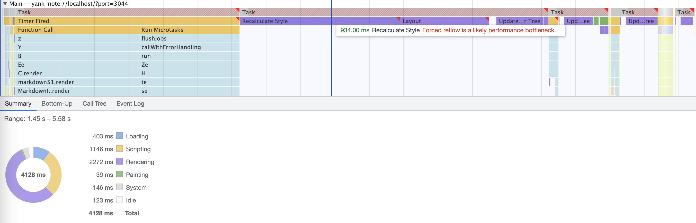
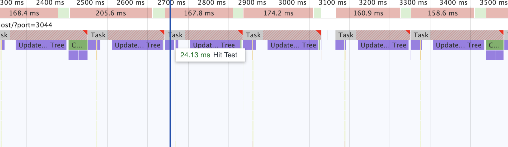
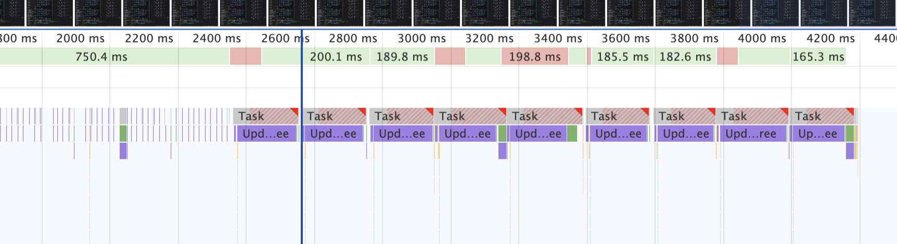
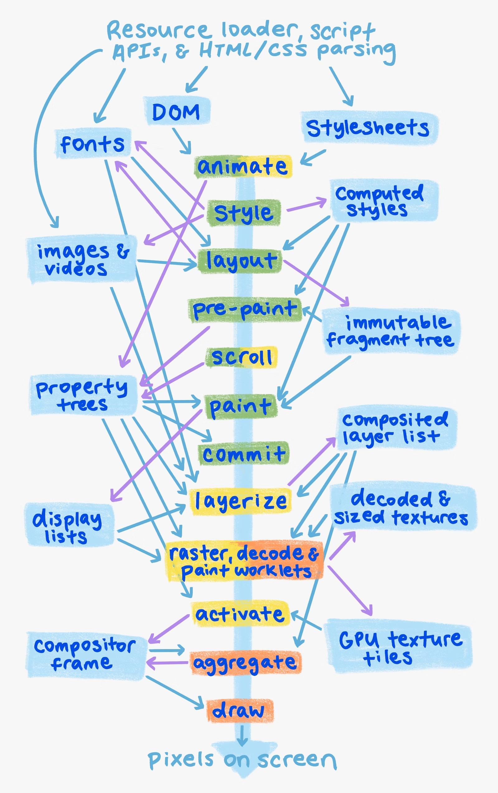
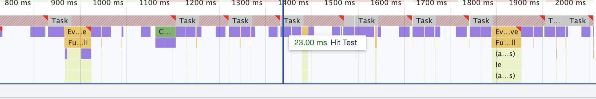
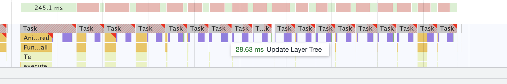
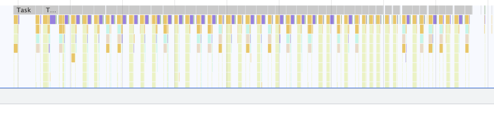
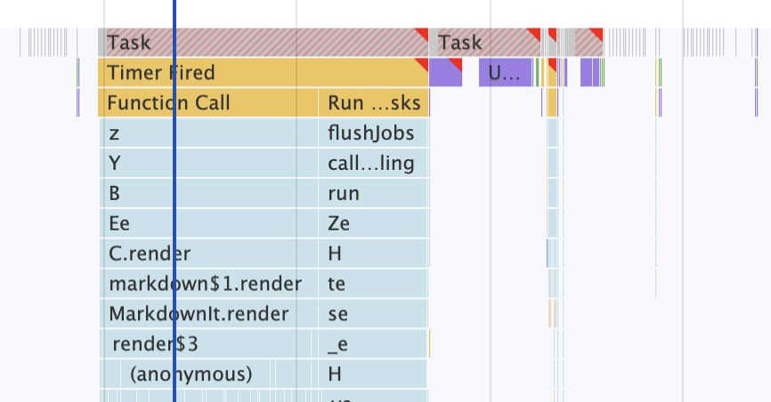
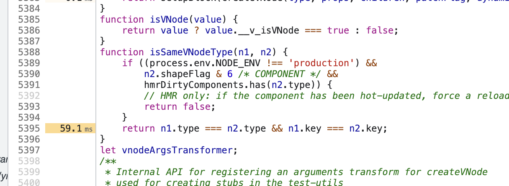

> [Yank Note](https://github.com/purocean/yn) 是我编写的一款面向程序员的笔记应用。这里我将会写下一些关于 Yank Note 的文章
> - [Yank Note 系列 01 - 为什么要自己写笔记软件？](/yank-note-01)
> - [Yank Note 系列 02 - Markdown 渲染性能优化之路](/yank-note-02)
> - [Yank Note 系列 03 - 同内存泄露的艰难战斗！](/yank-note-03)
> - [Yank Note 系列 04 - 编辑和预览同步滚动方案](/yank-note-04)
> - [Yank Note 系列 05 - 关于本地历史功能](/yank-note-05)
> - [Yank Note 系列 06 - 使用人工智能写文章是什么体验？](/yank-note-06)
> - [Yank Note 系列 07 - 性能暴增 132 倍的秘密——重写](/yank-note-07)
> - [Yank Note 系列 08 - 优化 Katex 公式渲染性能](/yank-note-08)
> - [Yank Note 系列 09 - 关于流的使用](/yank-note-09)
> - [Yank Note 系列 10 - 新增自定义快捷键功能](/yank-note-10)
> - [Yank Note 系列 11 - 预览内查找功能](/yank-note-11)

> 注：本文很多结论是实验得出的推断，如有误欢迎指正。

## 问题

不久前一位用户反馈，说使用 Yank Note 打开包含大量公式，几十万字符的文档十分卡顿。

话不多说，先建立一个测试文档，大约六千行，30 万字符，几乎全部是公式。

经过测试，发现有如下几个环节比较卡顿：

1. 打开文档时间较长
1. 滚动编辑器十分卡顿，没开启同步滚动也是如此
1. 文字输入时候很卡顿

而在之前的文章里，我已经讲述了为了优化性能所做的努力。如果不含大量公式，卡顿可能出现在环节 1，也不至于有环节 2 和环节 3 的问题。所以还需要进一步排查。

先说一下打开文档的过程。

要处理如此大的文档，需要处理几秒钟也很正常。使用 Typora 打开，情况也不乐观，不过 Typora 应该做了缓存，第二次打开就快了不少。

针对这种情况，一般优化都是“懒加载”。但我不喜欢这种方案——界面跳动闪烁、东西要出现在视口再显示（除非特别快，能用虚拟列表的场景）。这些就是我前面说的让应用变得复杂的例子。

那么还有什么可以改进的呢？那就是在打开文档时候，整个应用变得不可交互了。要处理这个就必须把渲染完全独立于应用才可以。理论上说，为了安全性和应用可响应，用户内容应该完全和应用主体隔离开，不过目前就不展开了，以后能有机会再慢慢做吧。

所以界定这次优化的主要目标：

1. 优化滚动交互体验
1. 优化文档编辑输入体验

## 滚动交互优化

编辑器的流畅性对体验很重要。而这方面你完全可以信任 Monaco 编辑器，这点文本量是毫无压力的。但是为什么在关闭同步滚动后，编辑器依然非常卡顿呢？

可以看到浏览器花了大量时间在 *Update Layer Tree* 和 *Hit Test* 操作上。

再测试一下预览区独立滚动情况，感官上还是比较流畅。但用性能分析工具一看，在滚动较慢的时候，性能非常差。查看帧数也只有 10 帧不到！

这里也花了大量时间在 *Update Layer Tree* 上。

按照我的理解，既然页面都渲染出来了，仅仅是滚动，甚至是其他元素无关的滚动，为什么有那么多 *Update Layer Tree* 的操作？

### 理论储备

说到优化渲染性能，就不得不提到这张很经典的像素流水线图

不过我觉得更细化到应该是下面这张图

现在的问题是出在图层合并上。需要看一下图层相关有没有什么问题。

而关于 *Hit Test*，这是用来计算鼠标命中的，将鼠标移到应用外部，用键盘滚动，这一块时间就消失了。

### 尝试一：使用 CSS contain 属性优化

关于 `contain` 属性，可以看 MDN 相关文章。总的来说，它就是为了性能优化而生的。

给预览区滚动容器加上 `contain: static` ，公式容器加上 `contain: paint`。再次测试，*Update Layer Tree* 操作时间从之前的 180ms 下降到了 30ms 左右，提升巨大！

### 尝试二：去掉 relative 定位

从上面的图可以看到 *Hit Test* 花了大量时间。

但是预览区域是独立的一个层，也不会有元素溢出。虽然里面有大量 DOM 节点，但是我的鼠标在编辑器，理论不会有很多元素参与 *Hit Test* 计算，时间消耗也应该不会那么多吧。

经过测试，发现只要去掉公式的相对定位，即可消除这一块的时间。

看来元素相对定位会影响到浏览器做 *Hit Test*。不过这一块我也没看到有人讨论这个事，懂的可以指教一下。

### 尝试三：使用 Web Components

Vue 3 可以非常容易的将现有组件转换成 Web Components。

但是经过测试，完全没用。该有的布局和图层操作都不会少。

### 最终解决方案：iframe 隔离

经过了上面的尝试，编辑器滚动性能提高了不少，但帧率还是 30 帧都达不到。并且去掉公式的 relative 定位，连功能都不能保证正常了。所以上面的尝试只能作为探究性能障碍用，完全不能作为解决方案。

再加上文档 DOM 节点过多，应用其他地方操作也不流畅了。看来还是只有隔离 iframe 渲染这一条路可走。欠下的债还是要还的。

Yank Note 是一步一步演化而来的，完全没有“顶层设计”。理论上说文档的渲染内容，应该要隔离到一个单独的沙盒中，兼顾安全和性能。这方面 VSCode 的架构做得非常牛逼和完善。

不过 Yank Note 是简单的东西，先不搞复杂了，就只是用 iframe 做渲染吧。为了 Hackable，js 进程也不隔离了。

**具体方案**

1. 新开一个 iframe
1. 使用 Vue 3 *Teleport* 标签，将文档内容渲染到 iframe
1. 做好样式注入、DOM 获取、打印等等后续工作。

经过了上面的折腾后，编辑器独立滚动时候，已经非常流畅了。但是预览区滚动，性能还是非常差劲。仍然是 *Update Layer Tree* 非常耗时。

于是我把文档导成 HTML，用浏览器打开，滚动测试性能，非常流畅。这里唯一的区别是，在应用中，文档在 div 中滚动。而导出的文档则是在 html 中滚动。

后面[搜到一点信息](https://www.zhihu.com/question/268016229)，大概就是确实有这个问题，容器设置背景色可以优化，但是试验了一番也没什么效果。所以干脆就直接整个页面滚动。

将滚动容器改变后，整体性能一下子就起来了。在开启同步滚动的情况下，编辑器可以很流畅的滚动了，性能分析也没有 *Long Task* 了，达到了预期的目的。

## 编辑输入优化

再说说输入优化。这里就容易多了。直接用工具分析。

### 公式渲染增加缓存

从上面可以看到公式渲染花了很长时间，但是用户在打字的时候，一般只会更新一个公式。其他公式是没有必要去再次解析的。这里可以加上缓存。

### 减少 Vue Key 长度

加上缓存后，渲染多次进行测试。又发现 Vue 更新 DOM 节点花了很长时间。

问题出现在对比虚拟节点 key 上面。

之前我是直接将公式 HTML 字符串作为 key。但是这个字符串可能会很长。和公式源码的差距可能达到几十上百倍。

改用公式源码+配置做 key 之后，这一句代码消耗时间下降到了零点几毫秒。

### 使用 requestIdleCallback

通过使用 `requestIdleCallback` 将不重要的如目录大纲更新、待办数量计算等放到浏览器空闲时候执行，也可以一定程度优化体验。不过很可惜这个 Api 不支持 Safari。

### 动态防抖优化

文字输入的交互优先级比实时渲染高。之前做的防抖渲染时间只是是根据 markdown-it 解析时间来预估的，没有考虑到渲染时间，所以在渲染复杂文档时候，预估的时间会偏小。加上渲染时间后，在文字输入时候卡顿情况就更少了。

## 一点感想

为什么我要一直和性能死磕呢，除了让产品有更好的体验外，另一个很重要的原因是平时的工作中，很少能有机会能接触到性能优化相关的东西，也很难深入细节去了解技术。

因此如果有性能上可以优化的地方——不会让应用过于复杂，也不会损失一般情况下性能和体验——我就会觉得非常开心。

## 参考

1. [Rendering Performance](https://web.dev/rendering-performance/)
1. [Overview of the RenderingNG architecture](https://developer.chrome.com/articles/renderingng-architecture/)
1. [contain - CSS（层叠样式表） | MDN](https://developer.mozilla.org/zh-CN/docs/Web/CSS/contain)
1. [chrome下div滚动卡顿该怎么处理？ - 知乎](https://www.zhihu.com/question/268016229)

> 本文由「[Yank Note - 一款面向程序员的 Markdown 笔记应用](https://github.com/purocean/yn)」撰写
