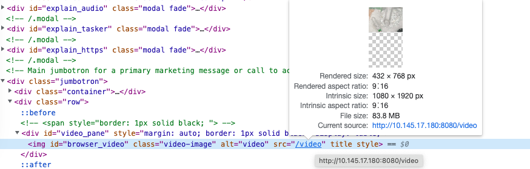
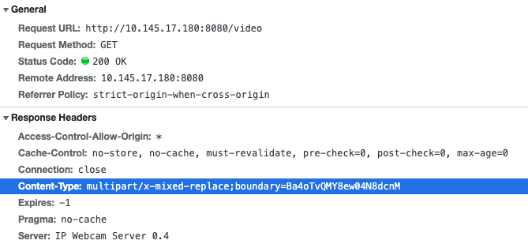
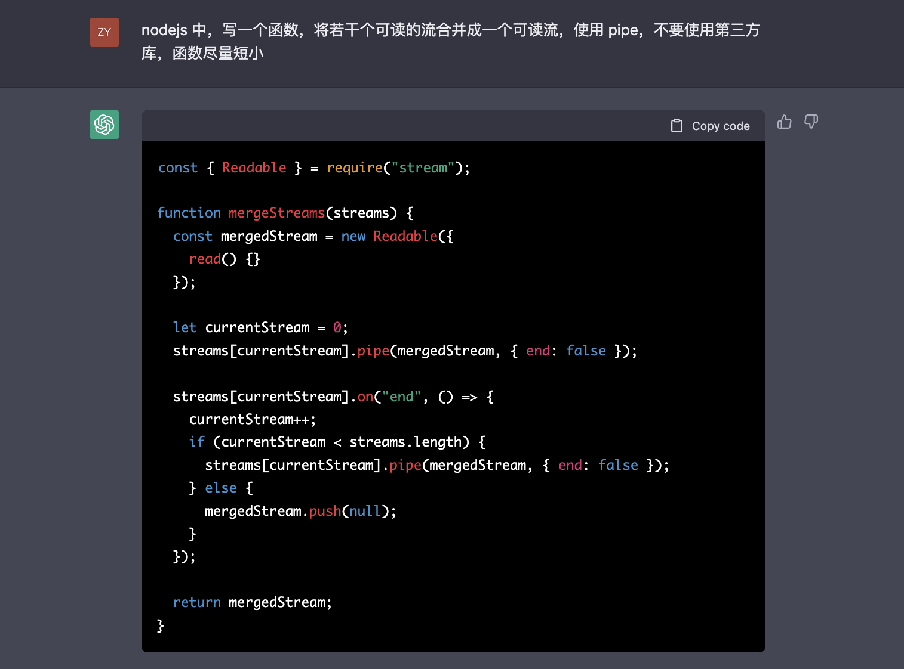

> [Yank Note](https://github.com/purocean/yn) 是我编写的一款面向程序员的笔记应用。这里我将会写下一些关于 Yank Note 的文章
> - [Yank Note 系列 01 - 为什么要自己写笔记软件？](/yank-note-01)
> - [Yank Note 系列 02 - Markdown 渲染性能优化之路](/yank-note-02)
> - [Yank Note 系列 03 - 同内存泄露的艰难战斗！](/yank-note-03)
> - [Yank Note 系列 04 - 编辑和预览同步滚动方案](/yank-note-04)
> - [Yank Note 系列 05 - 关于本地历史功能](/yank-note-05)
> - [Yank Note 系列 06 - 使用人工智能写文章是什么体验？](/yank-note-06)
> - [Yank Note 系列 07 - 性能暴增 132 倍的秘密——重写](/yank-note-07)
> - [Yank Note 系列 08 - 优化 Katex 公式渲染性能](/yank-note-08)
> - [Yank Note 系列 09 - 关于流的使用](/yank-note-09)


最近遇到三件事：

一是公司有个服务总是崩，同事查出来的原因是应用将文件直接读到内存来处理。遇到大一点的文件，内存占用直接飙升，64G的内存都不够使。

二是为了过年回家能看到我养的龟的状态，打算使用旧的安卓手机做监控。使用的 [IP Webcam] 这款软件。它的视频有个模式竟然能使用 `` 标签来播放视频，颠覆了我的认知。

最后在开发 Yank Note 的过程中，不少功能都用到了“流”，包括 nodejs 的 Stream 模块和浏览器端的 Web Stream 相关特性。

因此我想写一篇关于“流”的文章。

## 使用流来读取文件

比如读取一个文本文件来处理，有两种思路：一种是将文件直接读取到内存中，二是读一部分处理一部分。对于小文件，比如需要解析 json 配置文件，当然是前一种方式比较方便（json 也可以流式解析）。但是对于下载文件的场景，如果你把文件抓取到内存中，再保存文件，这样就得不偿失了。更好的做法是下载一部分就保存一部分。

对比如下伪代码：

```js
// 下载后再保存
const content = request(downloadUrl)
fs.writeFile(filePath, content)
```

```js
// 流式下载
request(downloadUrl).pipe(fs.createWriteStream(filePath, { mode: 0o755 }))
```

对于下载大文件这个场景来说，无疑是使用流更加节省内存。

所以公司里那个常常崩的应用，在满足业务的情况下，或许可以使用流来优化一下内存使用。毕竟 64G 的云服务器也是要花不少钱的。

## multipart/x-mixed-replace 相应头

[IP Webcam] 可以使用 `` 标签来播放视频




可以看到这个图片地址的响应头 `Content-Type` 是 `multipart/x-mixed-replace`，而不是 `image/*` 之类。查了一下资料，这个请求服务器可以不断的推送内容到浏览器，img 标签也能正确响应并替换为新的图片，达到播放“无声视频”的目的。

这里有篇文章可以参考：[使用 multipart/x-mixed-replace 实现 http 实时视频流 - 掘金](https://juejin.cn/post/6844903798998056967)

## Node.js Stream 和 Web Stream

我一直觉得 Nodejs 的 Stream 模块很难用（哪怕针对简单场景），每次使用都要现查资料，或者需要人工智能 [GPTChat](https://chat.openai.com/) 的帮助。




*上面的代码对不对我就不知道了。*

而 Web Stream 就不一样了，使用非常简单（默认策略）。 `fetch` 可以以流的方式来接收 Http 请求结果，参考 [Using readable streams - Web APIs | MDN](https://developer.mozilla.org/en-US/docs/Web/API/Streams_API/Using_readable_streams)。非常的方便实用。

下面我写一下 Yank Note 中使用到流的地方

### Electron 的自定义 protocol 兼容 Koa

Koa 是处理网络请求的，需要监听端口。但是苹果应用商店的政策是不能随便监听端口，否则过不了审核，不能上架。好在 Electron 可以自定义 protocol，只需要将接收到的流转化为 Koa 可以处理的请求。Koa 返回的流能传递给 Electron 就好了。

下面这段代码中我模拟了一个 Request 给 Koa。然后再使用 Proxy 代理模拟了一个 Response。并将 Koa 的响应相关方法调用重定向到模拟的 Response。

```js
export async function transformProtocolRequest (request: ProtocolRequest) {
  const req = new IncomingMessage(null as any)

  req.method = request.method
  req.url = request.url.replace(APP_NAME, 'http')

  Object.keys(request.headers).forEach(key => {
    req.headers[key.toLowerCase()] = request.headers[key]
  })

  const body = await transformBody(request.uploadData)
  if (body) {
    req.headers['content-length'] = body.length.toString()
    req._read = Readable.from(body)._read
  }

  const out = new Transform({
    transform (chunk, encoding, cb) {
      this.push(chunk, encoding)
      cb()
    },
  })

  const res = new Proxy(new ServerResponse(req), {
    get (target, prop: keyof typeof out) {
      const val = out[prop]
      if (val && typeof val === 'function') {
        return val.bind(out)
      }

      // eslint-disable-next-line @typescript-eslint/ban-ts-comment
      // @ts-ignore
      return target[prop]
    },
  })

  return { req, res, out }
}
```

### fetch 流式处理响应内容

浏览器的 Fetch API 提供了一种新的从服务器请求内容的方式，和传统 XMLHttpRequest 不一样，它支持使用流的方式来处理服务器端返回的内容。

Yank Note 目前有三个功能：

1. 全文搜索
2. 代码运行
3. 监听当前文件变更

这三个功能都会在服务端运行一段时间，途中服务器会实时的返回结果让前端展示或处理结果。因此按照通常的思路，这个功能使用 WebSocket 来做再合适不过了。实际上我一度也想过构建一个服务端和前端通信的通道。

但当我发现浏览器的 fetch API 支持流式处理后，我几乎没有犹豫的就使用的 fetch 来做上述的功能：实现简单，容易和现有的架构兼容。事实上，在没有 WebScoket 这个技术之前，前端和服务器端仍然可以通过使用“长轮询”来做到单向“实时通信”。

> 本文由「[Yank Note - 一款面向程序员的 Markdown 笔记应用](https://github.com/purocean/yn)」撰写

[IP Webcam]: https://play.google.com/store/apps/details?id=com.pas.webcam