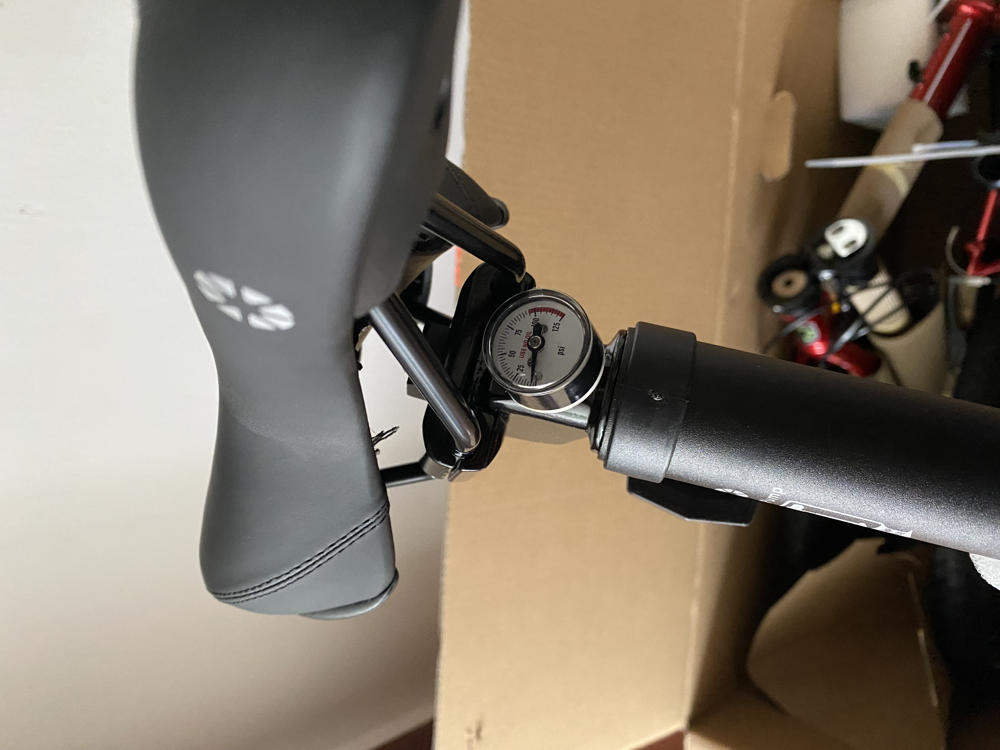

天气暖和了，又到了骑自行车的季节。我买了一辆自行车。

不过我买自行车不仅是想出去玩，还有通勤的需求。我现在住的地方离上班不远，平时都是骑共享自行车上班。但是最近不知道是不是成都又在搞什么运动，总之是共享自行车少了，早上常常要走很长一段距离才能找到车，又或者根本就找不到。加上未来几个月我会搬家，离上班的地方会更远一点，但我又不想放弃骑车通勤（我非常不喜欢挤地铁和被堵在路上的感觉）。因此，最终我还是买了一辆折叠自行车。

为什么买折叠自行车呢？首先明确我的需求是出去游玩和日常通勤，因此公路车就排除了。山地车有更好的适应性，但是体积比较大，如果出门游玩，携带没那么方便。如果在外面不想骑了，或者车坏了，直接打个车或坐地铁就能回家。

买车之前，我去大行和捷安特的店里试骑了几款车，还是比较喜欢钢架和V刹，大行 P8 (KBC083) 感觉比较合适。后面在闲鱼蹲了一段时间，害怕水太深，于是决定买新车。不过我没在实体店购买。一来我不太相信我去那个店，他们的一个店员车架材质都讲不清楚，二来我希望能自己亲手调整车辆，对自己的动手能力比较有信心。于是我直接在京东官方旗舰店购买了速联x7高配版。算上返佣一百多元，京豆，算下来裸车到手不到 3200 元。

如果哪位朋友看到这篇文章，并通过下面的链接购买的，可以联系我，佣金可以给你分一半。

购买链接：https://u.jd.com/i8Fmncb

先说一下车到手后发现的一些情况：

1. 坐管是带压力表的，之前在网上看到的其他人购买的都没有这个
1. 轮胎是正新轮胎 20x1.75，不是大苹果了
1. 变速是转把

车到手后基本不用调整就能骑。但是我骑了一下午后，还是微调了一下刹车，辐条，变速。

买的一些其他东西：

1. 车锁 https://u.jd.com/isFmjlk
通勤用途，车锁还是买一个。我直接买的大行车锁和自行车一起买的。

1. 刹车 https://u.jd.com/uqoZXpu
据说大行原厂刹车皮会伤圈，我是不咋相信的。但是骑了两天后，发现这个刹车皮确实好像有些掉黑粉。于是按网友推荐买了永杰的 959v，换了后刹车手感很舒服。

1. 车灯 https://u.jd.com/uzygbUo
买了一个尾灯和前灯。尾灯是支持刹车感应灯。

1. 码表 https://u.jd.com/uboYHMp
买的最便宜的顺东，我只是希望能看到一个速度和里程，其他高级功能我也用不着。

1. 挡泥板
车到之后，我买的挡泥板还没到，经过工地的路面有水渍，回家后我衣服后背都是泥点。所以挡泥板是必备的。我在淘宝随便买了一套塑料挡泥板。

1. 坐管包
买的犀牛座管包，最便宜的那种，用来放工具和一些其他东西。

1. 水壶架
也是在淘宝随便买的几块钱包邮的

1. 工具
买了一个便携式工具包，淘宝随便买的

至于其他方面，比如轮胎，座管，脚踏之类，先用用看，目前感觉没必要更换。

整个车骑起来既轻快又稳重，我很喜欢，后面希望能经常骑着它出去玩。

> 本文由「[Yank Note - 一款强大可扩展的 Markdown 编辑器](https://github.com/purocean/yn)」撰写
