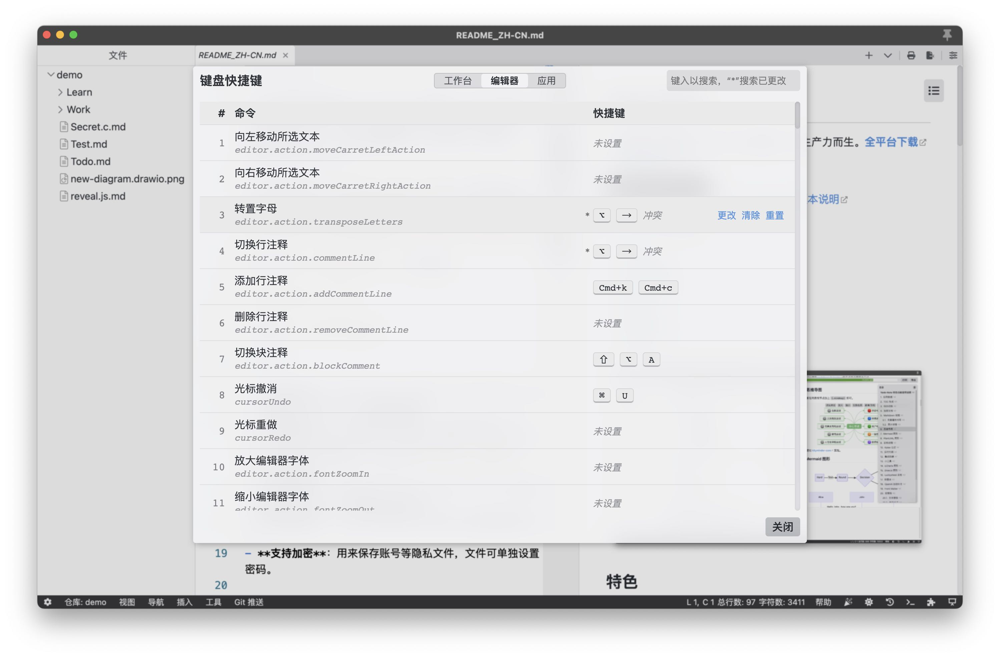

> [Yank Note](https://github.com/purocean/yn) 是我编写的笔记应用。这里我将会写下一些关于 Yank Note 的文章
> - [Yank Note 系列 01 - 为什么要自己写笔记软件？](/yank-note-01)
> - [Yank Note 系列 02 - Markdown 渲染性能优化之路](/yank-note-02)
> - [Yank Note 系列 03 - 同内存泄露的艰难战斗！](/yank-note-03)
> - [Yank Note 系列 04 - 编辑和预览同步滚动方案](/yank-note-04)
> - [Yank Note 系列 05 - 关于本地历史功能](/yank-note-05)
> - [Yank Note 系列 06 - 使用人工智能写文章是什么体验？](/yank-note-06)
> - [Yank Note 系列 07 - 性能暴增 132 倍的秘密——重写](/yank-note-07)
> - [Yank Note 系列 08 - 优化 Katex 公式渲染性能](/yank-note-08)
> - [Yank Note 系列 09 - 关于流的使用](/yank-note-09)
> - [Yank Note 系列 10 - 新增自定义快捷键功能](/yank-note-10)
> - [Yank Note 系列 11 - 预览内查找功能](/yank-note-11)

自定义快捷键是很多 Yank Note 用户的诉求，很抱歉这个功能鸽了好几年现在才做上。

这有两个原因，一方面是之前的开发阶段，Yank Note 很多地方不完善，有很多优先级更高的事情要做。另一方面则是做自定义快捷键功能要做得比较好，还是不太容易。比如要考虑各种键盘布局，解决快捷键冲突，一个易于使用的可视化配置界面等等。

不过好在 Yank Note 的核心设计考虑了要自定义快捷键的需求，这次做这个功能还算顺利。



可自定义快捷键的有三个部分：工作台、编辑器、应用

## 工作台

Yank Note 可以通过使用 `ctx.action.registerAction` 方法来注册一个操作，这个操作可以附带可响应的默认快捷键，如：

```js
registerAction({
  name: 'base.find-in-repository', // action 名
  keys: [CtrlCmd, Shift, 'f'], // 默认快捷键
  description: t('command-desc.base_find-in-repository'), // 描述
  forUser: true, // 用户是否可以配置
  handler, // 执行方法
})
```

通过上面的方法，就给工作台注册了一个“仓库中搜索”的 Action，关联的默认快捷键 是`CtrlCmd+Shift+F`

那么用户自定义快捷键后，怎样生效呢？

Yank Note 针对 Action 暴露了一个口子，可以拦截 action 的获取操作，进行一些定制性的修改。

```js
ctx.action.tapAction(action => {
    // 可以在这里动态修改快捷键
    // action.keys = 
})
```

这样，工作台的自定义快捷键就完成了。

## 编辑器

再说说自定义编辑器快捷键是怎样实现的。Yank Note 使用的是 Monaco 编辑器，也就是 VSCode 内部用的那个编辑器。因此这些快捷键定义好了，需要丢给 Monaco 来处理，具体可以参考这个 https://github.com/microsoft/monaco-editor/issues/102 Issue，里面讨论了在 Monaco 编辑器中怎样更改快捷键的方法。

不过网上关于 Monaco 或者说 VScode 快捷键相关的资料还是不够丰富，我还是选择了看源码。比起看文档，看源码更能了解整个工作流程的细节。下面的结论基本上都是翻了 VSCode 的源码得到的。

在 VSCode 中，Action 和 Command 和 Keybinding 概念是分开的，注册一个 Action 同时可以注册一个带快捷键的 Command，并有附带 Keybingding 规则。相关代码非常多，因为 VSCode 要考虑的情况也非常复杂。而 Yank Note 这次做的自定义快捷键功能包括一个配置面板和一个应用插件，简化了（不考虑）很多情况，相关代码也就一千多行。

### 让原有快捷键失效

配置快捷键使用 `monaco.editor.addKeybindingRules` 这个新引入不久的 API，有两种方法可以让一个已定义的快捷键失效：

```js
editor.addKeybindingRules([
    {
        // 方式一
        keybinding: KeyCode.F1,
        when: '条件表达式',
        command: null,
    },
    {
        // 方式二
        keybinding: KeyCode.F1,
        when: '条件表达式',
        command: '-editor.action.name',
    },
]);
```

虽然他们都表现为让 `F1` 快捷键失效，但具体到内部原理还是不一样的。

方式一的工作原理是新添加一个规则，让后面的规则覆盖原来的规则。这里就是按`F1`匹配到了规则，但是没有可以运行的命令。

方式二则是从原有的规则表中**删去**匹配到的规则（包含when表达式）。

如果要做一个**移除**现有命令快捷键的功能，最好不要用方式一，因为方式一会把规则中的已有的都覆盖掉（比如两个命令使用同一个快捷键的情况），无差别禁用。方式二则可以精确的去掉某个快捷键规则，让原有规则中的其他规则还能生效。

### 更改快捷键

不过更改一个快捷键光是移除还不够的，还需要添加一条新规则。这个规则需要知道命令的 id、快捷键的编码（VSCode 用一个数字来表示快捷键）以及这个规则原有的 when 表达式。

首先，用 `editor.getActions` 可以获取所有命令的 ID
接着，用 `editor._standaloneKeybindingService._getResolver().lookupPrimaryKeybinding` 获取一个命令原始的快捷键绑定情况，获得 when 表达式
最后，把 Yank Note 配置的快捷计算为一个 number 类型的编码，组装成规则后调用`editor.addKeybindingRules` 接口塞进去

这三步都各有各的坑：

1. 相关 API Monaco 编辑器也没暴露，只能翻源码+自己从实例里面找出来用用；
2. 快捷键按键规则是一个数字，但这个数字我翻看 VSCode 源码，内部又没咋用（进入内部就解码了），但接口又只能接受这种参数，只能自己参考内部的解码方法写一个编码方法。
3. 修饰键 KeyMod 中的 `CtrlCmd` 和 `WinCtrl` 也让我困惑了一阵子，好在 issue 有人解释 https://github.com/microsoft/monaco-editor/issues/2570#issuecomment-877997943
4. Monaco 支持 Chord 按键序列，Yank Note 不支持

这里就写这么多吧，希望能后面要自定义 Monaco 编辑器快捷键的伙伴做点参考。

## 应用

应用快捷键是指在 Electron 中注册的快捷键。这里只需要考虑将配置的快捷键转换为 Electron 接受的格式即可，可以参考 https://www.electronjs.org/docs/latest/api/accelerator 官方文档

## 更多

上面做了这么多工作，还有一件事没仔细考虑，那就是适应不同的键盘布局。这个问题事实上不那么容易处理。目前 Yank Note 先放过这一部分了。这里有几篇文章写得很好，推荐阅读

- [Web 应用快捷键支持（一）：正确处理 Keyboard Event](https://rebornix.com/vscode/2019/08/11/web-keyboard-support/)
- [Web 应用快捷键支持（二）：code/key 的缺点和 Node native keymap](https://rebornix.com/vscode/2019/08/25/web-keyboard-support-2/)
- [Web 应用快捷键支持（三）：VS Code 快捷键服务的实现](https://rebornix.com/vscode/2019/09/11/web-keyboard-support-3/)

以上就是 Yank Note 在做自定义快捷键功能时候相关的一些我觉得值得分享的东西，希望大家能喜欢这个功能。

> 本文由「[Yank Note - 一款强大可扩展的 Markdown 编辑器，为生产力而生](https://github.com/purocean/yn)」撰写
