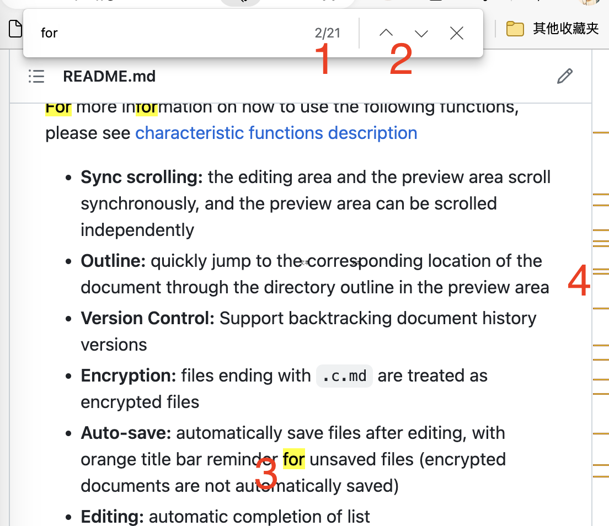
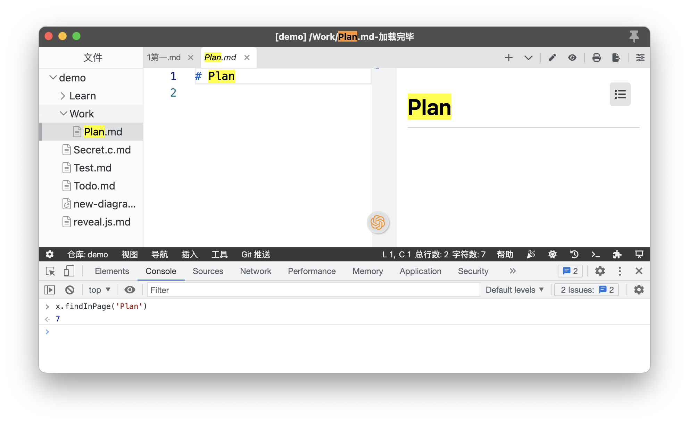
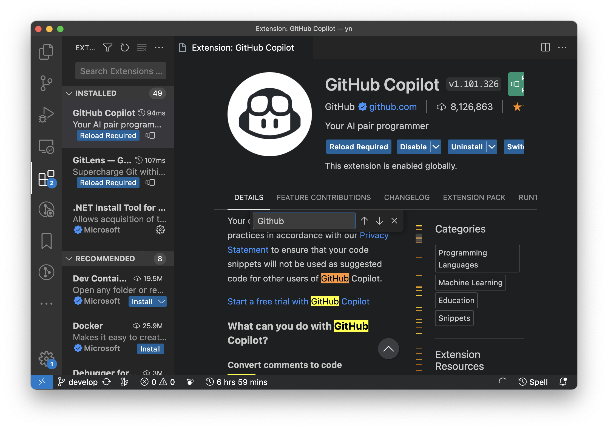
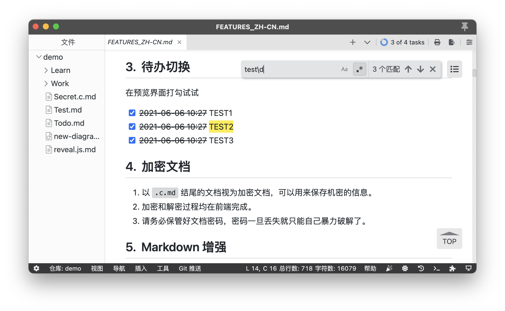

> [Yank Note](https://github.com/purocean/yn) 是我编写的笔记应用。这里我将会写下一些关于 Yank Note 的文章
> - [Yank Note 系列 01 - 为什么要自己写笔记软件？](/yank-note-01)
> - [Yank Note 系列 02 - Markdown 渲染性能优化之路](/yank-note-02)
> - [Yank Note 系列 03 - 同内存泄露的艰难战斗！](/yank-note-03)
> - [Yank Note 系列 04 - 编辑和预览同步滚动方案](/yank-note-04)
> - [Yank Note 系列 05 - 关于本地历史功能](/yank-note-05)
> - [Yank Note 系列 06 - 使用人工智能写文章是什么体验？](/yank-note-06)
> - [Yank Note 系列 07 - 性能暴增 132 倍的秘密——重写](/yank-note-07)
> - [Yank Note 系列 08 - 优化 Katex 公式渲染性能](/yank-note-08)
> - [Yank Note 系列 09 - 关于流的使用](/yank-note-09)
> - [Yank Note 系列 10 - 新增自定义快捷键功能](/yank-note-10)
> - [Yank Note 系列 11 - 预览内查找功能](/yank-note-11)
> - [Yank Note 系列 12 - 高效构建仓库索引与知识图谱](/yank-note-12)

同样“自定义快捷键”功能一样，预览内查找功能也很早之前就有用户希望 Yank Note 能有这个功能，这个功能也迟迟没做上。之前也调研过一些方案，都不太满意。不过，一个不完美的功能，能满足用户部分需求，那么也还是可以先做上。

## 功能期望

首先说一下我理想中的“预览页内查找”功能是怎样的。

类似浏览器的“页内查找”功能，需要

1. 支持展示匹配数量和当前定位的序号
1. 支持向上/向下查找
1. 可以高亮当前和已匹配的文字
1. 滚动条可以显示已匹配文字的位置

除此之外，还有一些

1. 支持大小写敏感
1. 支持全字匹配
1. 支持正则表达式

## 一些方案

要实现这个功能，目前只能分为两个方向：使用 Electron 的方法，或者基于 Web 接口。

### 1. 基于 Electron

浏览器的“页内查找”功能已经做得比较好了，而 Yank Note 是基于 Electron 的，应该也能有这样的接口可以来实现“页内查找吧”。

翻 Electron 文档确实找到了一个 [findInPage Api](https://www.electronjs.org/docs/latest/api/web-contents#contentsfindinpagetext-options)

不过这个 API 有一些局限性，那就是真的只能实现“页内查找”。Yank Note 文档是放到 iframe 内渲染的，强行使用那就只能是这个效果。

于是我开始找有没有能在 iframe 搜索的 Electron 接口。

幸运的是，VSCode 开发团队也遇到了这个问题，这里有个 [Issue](https://github.com/microsoft/vscode/issues/96307) 讨论了在 Electron 中实现 iframe 页内查找的方法。

VSCode 团队确实比较牛逼，发现 Electron 没有这个功能，直接改造 Electron，加上了 [findInFrame/stopFindInFrame](https://github.com/electron/electron/pull/28274) 方法，实现了在 iframe 中查找的功能。

体验了一下 VSCode，确实效果已经很不错了。

不过遗憾，上面的 PR Electron 也没有合并，翻看 VSCode 源码虽然确实用的 `findInFrame/stopFindInFrame` 方法，但VSCode 发行版的 Electron [是自己内部的一个分支，并未对外开放](https://github.com/microsoft/vscode/issues/96307#issuecomment-821746677)。

我下载了 VSCode 的开源版本[VSCodium - Open Source Binaries of VSCode](https://vscodium.com/)，发现这个功能根本就不能使用，完全的残废。。。

### 2. 基于 Web 接口

基于 Web 来做的话，基本只有使用 [window.find](https://developer.mozilla.org/en-US/docs/Web/API/Window/find) 来做，其他方案如自己做搜索匹配和高亮，实现起来都会非常复杂且通用性不高。

这个接口还是有不少缺点：

1. 不能高亮所有的匹配项
1. 滚动条不能显示匹配位置
1. 不能获取匹配数量
1. 不能指定和显示匹配位置
1. 非标准接口，但是兼容性还行
1. 当前匹配项是选中状态而不是 [highlight](https://developer.mozilla.org/en-US/docs/Web/API/Highlight) 状态

VSCode 的网页版本，也是用的这个接口来做的，只能说功能比起上面的就差太多了，而且也有些小问题，比如上下箭头激活状态不正确。

不过，也有用这个接口做得比较好的产品，如 Chrome 的 [Vimium](https://github.com/philc/vimium) 插件，就是用这个接口实现了页内查找功能，能展示匹配数量且支持正则表达式。

看源码，他能展示匹配数量和支持正则表达式的原理是从 `document.body.innerText` 自己做匹配，计算出每一处的匹配字符串和数量，拿着每一处的匹配字符串调用 `window.find` 来实现页内查找功能。

当然这个方案的缺点就在于用 `document.body.innerText` 匹配的东西不一定和 `window.find` 一致。因此也没法实现展示当前匹配位置的功能。然后就是有时候虽然有匹配项，但点击查找也会“踏空”。

至于高亮状态，他用了一个很巧妙的方式来解决：在调用 `window.find` 时候给页面设置一个样式类，使用 `::selection` 选择器来高亮匹配项。接着监听 `selectionchange` 事件，移除这个样式类。

## 最终方案

考虑如下几点

1. Electron 上游的 `findInFrame/stopFindInFrame` 还不可用
1. 自己编译一套 Electorn 成本太高
1. Yank Note 需要支持在浏览器中使用

所以排除使用 Electron 的方案。聚焦参考 Vimium，使用 `window.find` 来实现。

## 效果

具体实现情况：

1. 支持展示匹配数量和当前定位的序号：**只支持展示匹配数量，且不一定准确**
1. 支持向上/向下查找：**支持**
1. 可以高亮当前和已匹配的文字：**不支持**
1. 滚动条可以显示已匹配文字的位置：**不支持**
1. 支持大小写敏感：**支持**
1. 支持全字匹配：**不支持**
1. 支持正则表达式：**支持**

虽然还是没完全达到理想中的效果，但至少功能有了，能满足一部分需求，还是很不错了。

> 本文由「[Yank Note - 一款强大可扩展的 Markdown 编辑器，为生产力而生](https://github.com/purocean/yn)」撰写
