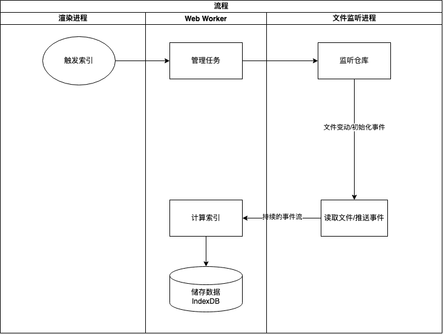
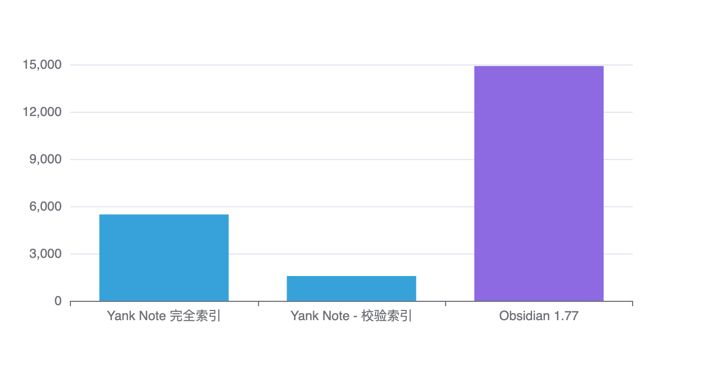
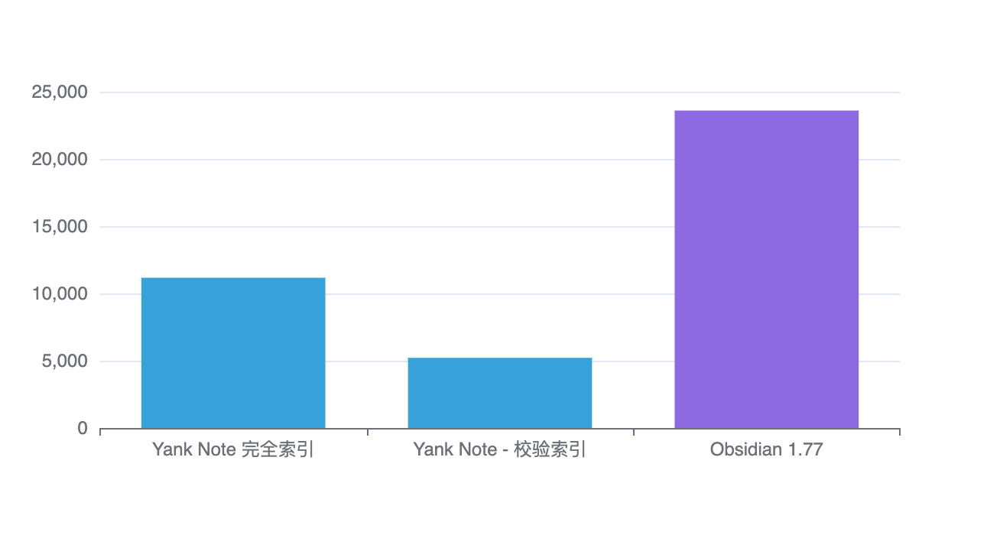
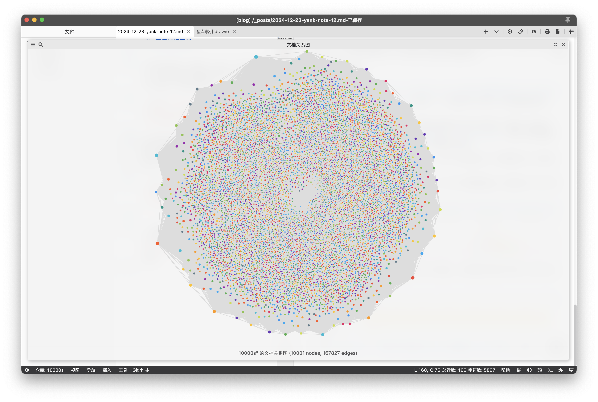
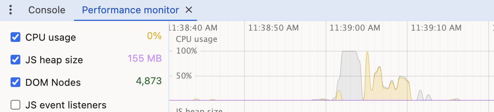
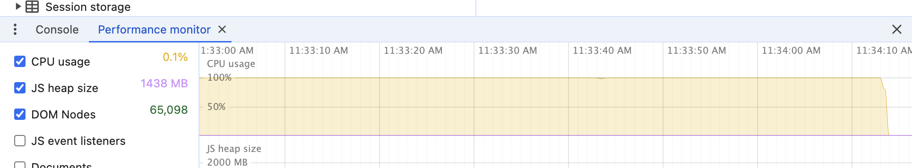

> [Yank Note](https://github.com/purocean/yn) 是我编写的笔记应用。这里我将会写下一些关于 Yank Note 的文章
> - [Yank Note 系列 01 - 为什么要自己写笔记软件？](/yank-note-01)
> - [Yank Note 系列 02 - Markdown 渲染性能优化之路](/yank-note-02)
> - [Yank Note 系列 03 - 同内存泄露的艰难战斗！](/yank-note-03)
> - [Yank Note 系列 04 - 编辑和预览同步滚动方案](/yank-note-04)
> - [Yank Note 系列 05 - 关于本地历史功能](/yank-note-05)
> - [Yank Note 系列 06 - 使用人工智能写文章是什么体验？](/yank-note-06)
> - [Yank Note 系列 07 - 性能暴增 132 倍的秘密——重写](/yank-note-07)
> - [Yank Note 系列 08 - 优化 Katex 公式渲染性能](/yank-note-08)
> - [Yank Note 系列 09 - 关于流的使用](/yank-note-09)
> - [Yank Note 系列 10 - 新增自定义快捷键功能](/yank-note-10)
> - [Yank Note 系列 11 - 预览内查找功能](/yank-note-11)
> - [Yank Note 系列 12 - 高效构建仓库索引与知识图谱](/yank-note-12)

## 背景

在之前的[Yank Note 系列 01 - 为什么要自己写笔记软件？](/yank-note-01)中，我提到了虽然我不认为双链是很必要的功能，但我仍然希望能够在我的笔记应用中能查看某个文档引用了哪些其他文档，以及有哪些文档引用了这个文档。当然能展示出仓库的知识图谱最好了，这样可以更好地展示笔记之间的关系。

另外，很多用户提出希望能清理仓库中的死链和未使用的图片，以及在移动/删除文档的时候，能顺便处理文档所使用的图片。这个功能也需要对仓库进行感知索引，才能很方便的实现。

这篇文章中，我主要记录一下我实现仓库索引和展示知识图谱的过程。至于仓库资源管理功能，等后面把资源管理功能做好再说了。

## 构建仓库索引

之前为了实现快速搜索功能，我尝试写过一些实验性代码，[使用FlexSearch](https://github.com/nextapps-de/flexsearch) 针对仓库做全文索引，后来发现使用 [ripgrep](https://github.com/BurntSushi/ripgrep) 搜索效果也不错，为此我专门从 VSCode 的代码中提取出 [ripgrep-wrapper](https://github.com/purocean/ripgrep-wrapper) 库来使用，就暂时没必要做全文索引了。

我这里说的仓库索引，其实是对仓库中所有的文档计算出一些数据，用来辅助知识图谱和资源管理功能的实现。在 Obsidian 中叫*缓存*。未来如果仓库要接入人工智能做 RAG，这套设计也需要能很方便的进行扩展。

### 整体思路

因为仓库中的文档可能会随时被其他应用修改，所以索引的过程需要和应用的逻辑解耦，需要监听文件来实现。





### 监听文件

在 Node 侧，我使用 [Chokidar](https://github.com/paulmillr/chokidar) 来监听文件变动，文件变动的事件使用 [SSE](https://developer.mozilla.org/zh-CN/docs/Web/API/Server-sent_events/Using_server-sent_events) 的方式推送到浏览器端。

最初我直接在 Node 侧主线程中监听文件，后面发现文件太多的情况下，初始化监听会消耗大量 CPU 资源，导致主线程卡住，具体表现在应用菜单点击无反应。因此我使用 Node 的 [Worker threads](https://nodejs.org/api/worker_threads.html)，新开一个线程来做监听工作，效果很不错。

后来，为了提高初始化构建索引速度，我在文件事件发出前读取文档，将文档内容和事件一同推送到浏览器。为了尽可能快的读取文档，读取文件的过程都是并行的，但是这样又产生了两个新问题。

一是不能保证事件顺序。因为读取文件和文件事件处理完毕后才推送到浏览器，有序的事件顺序就有可能打乱。这里我维护了一个 Promise 队列来解决。

二是在处理大仓库时候可能会产生 `EMFILE` 错误，Windows 上会更频繁。我读取文件使用的 [fs-extra](https://github.com/jprichardson/node-fs-extra) 库，它的底层使用了 [graceful-fs](https://github.com/isaacs/node-graceful-fs) 这个库。这个库在遇到 `EMFILE` 错误的时候，会自动将读取请求加入到一个队列，由定时器和读取操作来驱动这个队列运行，理论上这个错误是不会出现的。但是应用基础配置文件操作必须使用同步的方式读取和写入文件，以避免一些并发冲突，所以 graceful-fs 这套机制就失效了。

为了解决这个问题，我不再使用 Worker thread，取而代之的是使用 [child_process.fork](https://nodejs.org/api/child_process.html) 来新开一个进程监听文件。因为操作系统限制打开文件数是针对进程的，因此新开一个进程就好了。这样也更加做到了监听文件和主流程解耦。

完成了这些工作后，监听文件的事件推送到浏览器速度已经非常快了，但是我发现在 Chrome 中的速度还是会比在应用中快一倍多。后来我在 [New in Chrome 124](https://developer.chrome.com/blog/new-in-chrome-124?hl=zh-cn#streams-in-sockets) 发现 Chrome 124 版本新加了 `WebSocket Stream` API，能自动处理流背压过高的问题。可能这也将 SSE 的背压处理也一并优化了。所以升级 Electron 版本后，我获得了免费的性能提升。

### 处理文档

为了更好的复用代码，我选择在浏览器端处理文档。然而处理文档是计算密集任务，所以使用 [Web Worker](https://developer.mozilla.org/zh-CN/docs/Web/API/Web_Workers_API/Using_web_workers)，新开一个线程就是必要的选择。

Web Worker 有很多限制，不能使用主线程很多的 API，因此很多代码需要纯函数化或者判断执行环境。

因为 Worker 和和主线程交互比较多，直接使用原始的 `postMessage` 会很麻烦，所以我使用了之前写的一个 JSON-RPC 通信库 [jsonrpc-bridge](https://github.com/purocean/jsonrpc-bridge) 来简化通信过程。

### 储存数据

浏览器自带一个数据库 [IndexedDB](https://developer.mozilla.org/zh-CN/docs/Web/API/IndexedDB_API)，用来储存这种缓存的，需要高效查询的数据再合适不过。为了更好的使用 IndexedDB，我使用 [Dexie.js](https://dexie.org/) 来操作 IndexedDB。

在需要存储大量文件索引时，IndexedDB的数据插入速度仍有提升空间。最初，我采用逐条使用`put`方法插入数据，导致整体速度较慢。后来，我改为在初始化阶段先在内存中处理数据，然后进行批量插入，显著提高了速度。

### 性能对比

我使用 https://github.com/rcvd/interconnected-markdown 这个仓库的 10000s 目录中的一万个文档多次做粗略的测试，看看对比 Obsidian 性能如何。

在我的 MacBook M3 Pro 芯片的笔记本上，Obsidian 1.77 需要接近 15s 才能完成索引。**而 Yank Note 完全索引这个仓库大约只需要 5.5s，如果只是校验索引甚至只需要 1.5s**。对于常规仓库，基本只需要一秒不到就能完成。

<!-- ```js
// --echarts-- 
const option = {
  xAxis: {
    type: 'category',
    data: ['Yank Note 完全索引', 'Yank Note - 校验索引', 'Obsidian 1.77']
  },
  yAxis: {
    type: 'value'
  },
  series: [
    {
      data: [
        5480,
        1573,
        {
          value: 14900,
          itemStyle: {
            color: 'rgb(141,106,226)'
          }
        },
      ],
      type: 'bar'
    }
  ]
};

chart.setOption(option, true)
``` -->



我另一台 Windows 电脑上，可能是磁盘性能差异或操作系统打开多文件的限制，索引速度均慢了一些，不过仍然比 Obsidian 快。

<!-- ```js
// --echarts-- 
const option = {
  xAxis: {
    type: 'category',
    data: ['Yank Note 完全索引', 'Yank Note - 校验索引', 'Obsidian 1.77']
  },
  yAxis: {
    type: 'value'
  },
  series: [
    {
      data: [
        11169,
        5215,
        {
          value: 23600,
          itemStyle: {
            color: 'rgb(141,106,226)'
          }
        },
      ],
      type: 'bar'
    }
  ]
};

chart.setOption(option, true)
``` -->



当然 Obsidian 内部做的事情比 Yank Note 多了很多，因此这个对比并不公平。但是这个对比也说明了，Yank Note 的设计是可行的，能够在大仓库中快速构建索引。

## 展示知识图谱

首先是展示库的选型，[据说 Obsidian 之前只用的 D3 库，后来因为性能原因使用了 PixiJS 自行实现](https://forum.obsidian.md/t/understanding-the-graph-view-core/41020/2)。我也用 [d3](https://d3js.org/) 试验了一下，因为是 SVG 渲染，所以性能相当差劲。PixiJS 定制化又太费周章了。

我不需要动画，也不需要拖拽牵引等高级功能，只要能简单的展示文档之间的关系即可，但性能一定要过得去。因此另外又找了 [Cytoscape.js](https://js.cytoscape.org/)，[force-graph](https://github.com/vasturiano/force-graph)，[3d-force-graph](https://github.com/vasturiano/3d-force-graph) 等库，他们功能都很强大，甚至能在 3D 空间中展示。但是使用上面一万个文档的仓库测试，性能都差点意思。

后面我找到了 [Sigma.js](https://www.sigmajs.org/)，这个库采用 [WebGL](https://developer.mozilla.org/zh-CN/docs/Web/API/WebGL_API) 技术，渲染相当快，但功能确实不多，只是基本能满足我的需求。



这是测试仓库的关系图。10001 个节点，167827 条边，三秒（灰色）就能加载出来。缩放时候，渲染（黄色）性能也能接受，整个应用 Js 堆内存占用仅 155MB。



而 Obsidian 则需要快三分钟渲染才稳定下来，与此同时，Js 堆内存占用高达 1.4GB。关闭 Graph View 页面时候也长时间无反应。



当然还是那句话，Obsidian 的 Graph View 功能比我这个强太多了，渲染慢点正常。但是能在大仓库中快速展示出关系，是我更想要的。

## 总结

这篇文章主要记录了我如何实现仓库索引和展示知识图谱的过程。这个功能是 Yank Note 的一个重要功能，能够帮助用户更好的管理仓库资源，展示文档之间的关系。如果你需要这个功能，请升级 Yank Note 到最新版并安装 Graph View 扩展。

> 本文由「[Yank Note - 一款强大可扩展的 Markdown 编辑器，为生产力而生](https://github.com/purocean/yn)」撰写
