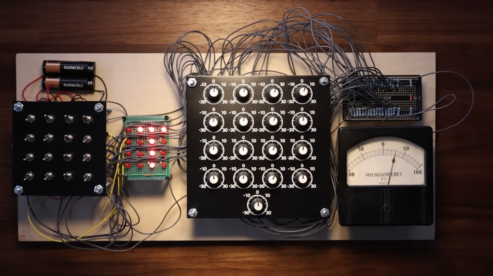
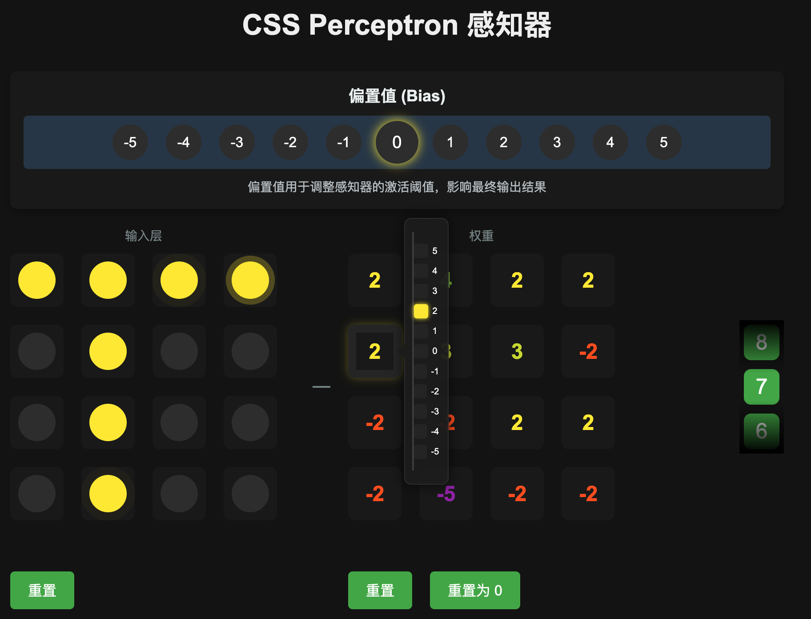
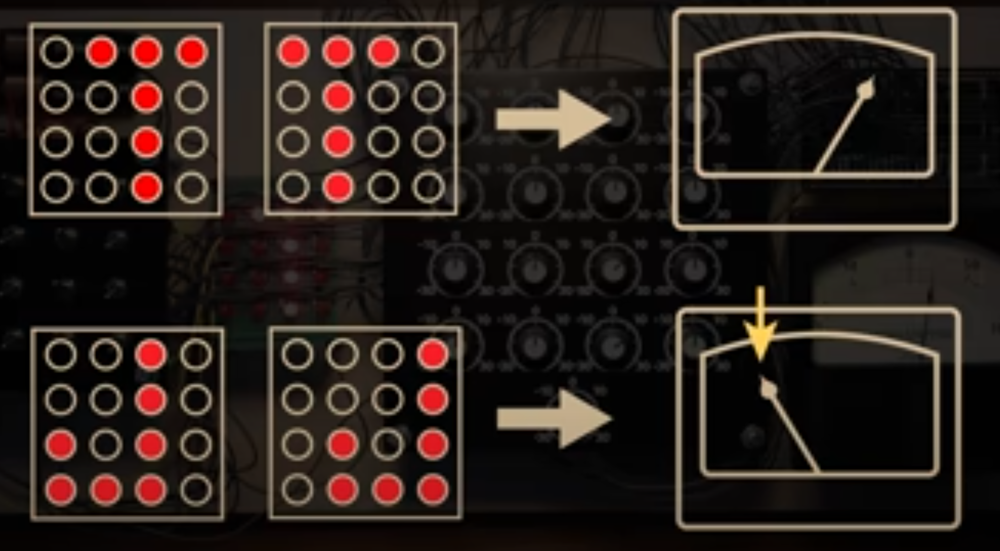
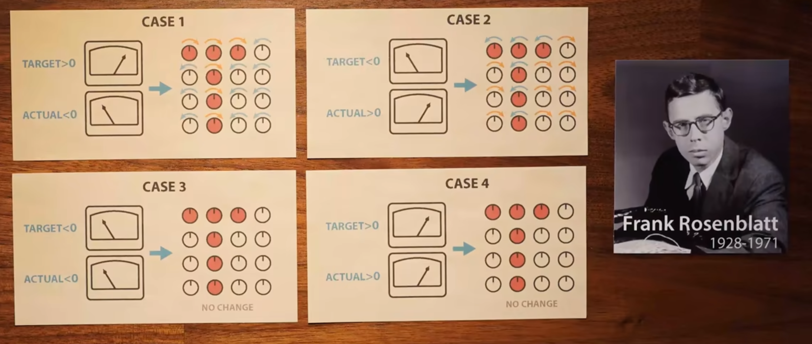
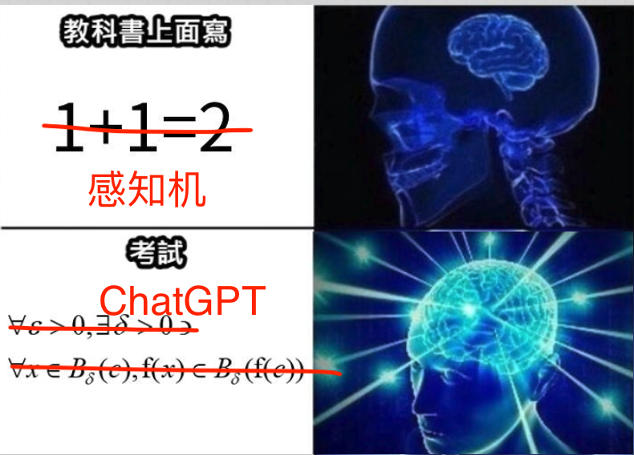

一提起人工智能，大家首先想到的开发语言应该是 Python，再不济也是 C++ 之类高性能语言。现在人工智能大潮来势汹汹，前端也要来凑凑热闹。但放着好好的 [TensorFlow.js](https://www.tensorflow.org/js?hl=zh-cn) 不用，我偏要用 CSS 来搞一搞。

哈哈哈开个玩笑了，在很多人眼里 CSS 都不能算作一门编程语言，但我还是想把他和人工智能扯上那么一点点关系。

事情的起因是某一天我看到了这个视频 [ChatGPT 是拿一亿个这种感知机做的](https://www.youtube.com/watch?v=l-9ALe3U-Fg)，内容是关于人工智能的核心基础——感知机。

我看了这个视频后，就想用网页来模拟一个这样的 Perceptron 感知机，后面觉得应该不用 js 也可以做到，那就试试吧。

主要实现原理是使用 input 标签的勾选来改变 CSS 变量储存状态，然后使用 calc 计算。整个过程中使用 Cursor agent 模式，虽然他有时候也会偷懒不爱输出大段重复的 CSS，但有了这个给力的工具，还是很快就完成了。

来上手玩一玩：https://purocean.github.io/css-perceptron/

**识别目标：** 区分用户画的是 “T” 还是 “J”，如果是 “T” 输出正值（绿色），如果是 “J” 输出负值（红色）

**训练识别步骤：**
1. 设定一个学习率，这里我给每个权重定义了正负五个档位，我这里学习率就定2个档位
2. 将权重清零
3. 先画出一个 “T”，将权重中的所有和 “T” 未知对应的部分，**增大** 2 个档位，其他的**减小**2个档位
4. 然后画出一个 “J”，将权重中的所有和 “J” 未知对应的部分，**减小** 2 个档位，其他的**增大**2个档位
5. 画出不同的 “T” 和 “J”，重复 3 和 4 步骤

**好了勇士，现在你已经会做感知机了，接下来就做一亿个，拼成 ChatGPT 吧！**

> 本文由「[Yank Note - 一款强大可扩展的 Markdown 编辑器，为生产力而生](https://github.com/purocean/yn)」撰写
