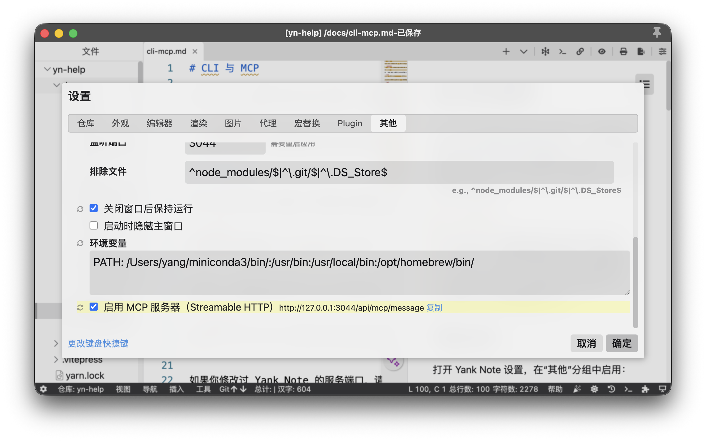
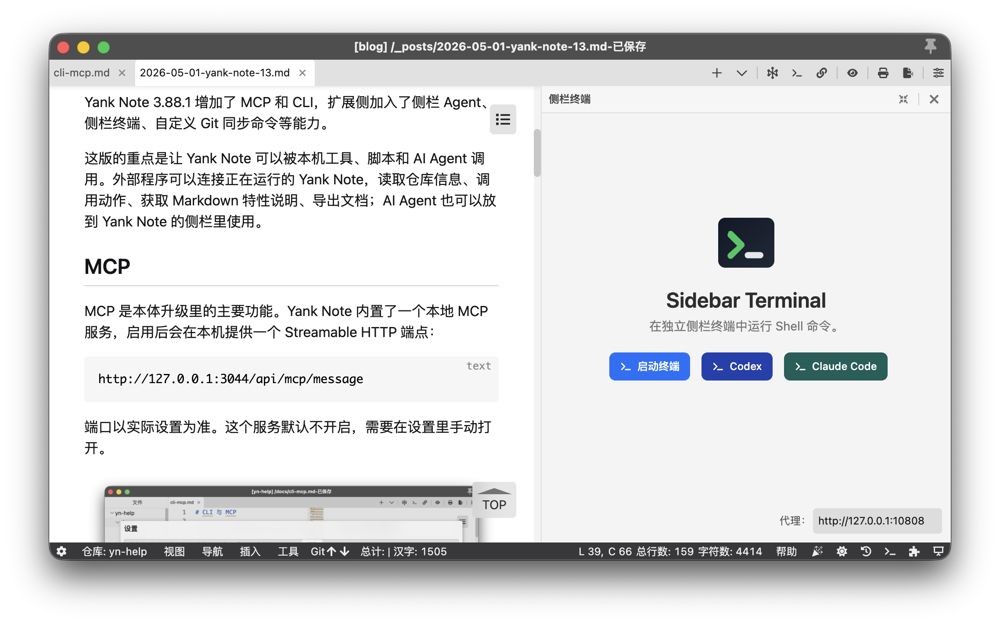

> [Yank Note](https://github.com/purocean/yn) 是我编写的笔记应用。这里会写下一些关于 Yank Note 的文章
> - [Yank Note 系列 01 - 为什么要自己写笔记软件？](/yank-note-01)
> - [Yank Note 系列 02 - Markdown 渲染性能优化之路](/yank-note-02)
> - [Yank Note 系列 03 - 同内存泄露的艰难战斗！](/yank-note-03)
> - [Yank Note 系列 04 - 编辑和预览同步滚动方案](/yank-note-04)
> - [Yank Note 系列 05 - 关于本地历史功能](/yank-note-05)
> - [Yank Note 系列 06 - 使用人工智能写文章是什么体验？](/yank-note-06)
> - [Yank Note 系列 07 - 性能暴增 132 倍的秘密——重写](/yank-note-07)
> - [Yank Note 系列 08 - 优化 Katex 公式渲染性能](/yank-note-08)
> - [Yank Note 系列 09 - 关于流的使用](/yank-note-09)
> - [Yank Note 系列 10 - 新增自定义快捷键功能](/yank-note-10)
> - [Yank Note 系列 11 - 预览内查找功能](/yank-note-11)
> - [Yank Note 系列 12 - 高效构建仓库索引与知识图谱](/yank-note-12)
> - [Yank Note 系列 13 - 让 AI Agent 进入笔记工作流](/yank-note-13)

Yank Note 3.88.1 增加了 MCP 和 CLI，扩展侧加入了侧栏 Agent、侧栏终端、自定义 Git 同步命令等能力。

这版的重点是让 Yank Note 可以被本机工具、脚本和 AI Agent 调用。外部程序可以连接正在运行的 Yank Note，读取仓库信息、调用动作、获取 Markdown 特性说明、导出文档；AI Agent 也可以放到 Yank Note 的侧栏里使用。

## MCP

MCP 是本体升级里的主要功能。Yank Note 内置了一个本地 MCP 服务，启用后会在本机提供一个 Streamable HTTP 端点：

```text
http://127.0.0.1:3044/api/mcp/message
```

端口以实际设置为准。这个服务默认不开启，需要在设置里手动打开。



MCP 连接的是本机正在运行的 Yank Note。它可以调用动作、读取仓库信息、导出文档。这个端点只应该在可信环境中使用，**不要暴露到公网**。

目前 Yank Note 通过 MCP 暴露了几个工具：

| 工具 | 能力 |
| --- | --- |
| `yn_list_actions` | 列出当前可被 MCP 调用的 Yank Note 动作 |
| `yn_execute_action` | 按动作名执行 Yank Note 动作，并传入参数 |
| `yn_get_markdown_features_doc` | 获取 Yank Note 内置 Markdown 扩展语法说明 |
| `yn_export_document` | 按仓库路径或绝对路径导出文档 |
| `yn_reload_main_window` | 重载 Yank Note 主窗口，可用于扩展开发调试 |

其中 `yn_execute_action` 是连接外部工具和 Yank Note 内部能力的桥。Yank Note 本来就有 Action 机制，例如切换侧栏、打开搜索、列出仓库、刷新预览等操作。只要 Action 标记为可给 MCP 使用，外部工具就能调用它。

## CLI

直接接 MCP 可以，但命令行使用更方便。因此这版也提供了官方 CLI：[@yank-note/cli](https://github.com/purocean/yank-note-cli)。

CLI 本质上是对本地 MCP 服务的封装。它会读取 Yank Note 的连接配置，然后调用 MCP 工具。

给 AI Agent 用时，首推使用 CLI 项目里的 [SKILL.md](https://github.com/purocean/yank-note-cli/blob/main/SKILL.md)。把它交给支持 Skill、Rules 或 Instructions 的 AI 工具后，AI 能知道什么时候使用 CLI、什么时候加 `--json`、导出时有哪些参数。

手动使用时，可以先检查当前环境：

```bash
npx @yank-note/cli doctor
```

查看仓库：

```bash
npx @yank-note/cli list-repo
```

列出可调用动作：

```bash
npx @yank-note/cli list-action
```

获取 Yank Note 的扩展 Markdown 语法说明：

```bash
npx @yank-note/cli markdown-features --language zh-CN
```

导出文档：

```bash
npx @yank-note/cli export --absolute-path /path/to/doc.md --to html
```

如果是给脚本使用，可以加 `--json`，这样输出更稳定，后续处理也方便。

```bash
npx @yank-note/cli --json list-repo
```

AI 不需要猜 Yank Note 的内部目录结构，也不需要直接读写不稳定的私有文件。它可以先 `doctor` 检查连接，再 `list-repo` 找仓库，需要了解语法时调用 `markdown-features`，需要产物时调用 `export`。

## 导出自动化

之前 Yank Note 就能导出 HTML、PDF、DOCX 等格式，但主要面向手动操作。MCP 导出做完后，导出能力可以被外部程序稳定调用。

导出相关也做了一些修补，包括增强导出 HTML 的代码块、处理 `file://` 图片本地化、绝对路径图片附件回退、打开回退图片路径等问题。

## 侧栏中的 AI Agent

扩展侧也有变化。

之前 AI Copilot 更偏向“编辑器里的文本助手”：选中文本、修改文本、生成内容、补全内容。新的方向是把终端型 AI Agent 放进 Yank Note 的侧栏。

OpenCode 扩展已经支持在右侧面板中使用，Sidebar Terminal 扩展则替代了原来的终端扩展。它们都可以从标签栏快速打开，也可以在侧栏中展开使用。



AI Agent 往往是终端程序。放到 Yank Note 侧栏里后，可以一边查看或编辑文档，一边在侧栏里运行 Agent。

Sidebar Terminal 还增加了自定义启动命令，可以把常用命令做成按钮。例如直接启动 `codex`、`claude`，或者启动自己的脚本。命令可以添加、编辑、删除和排序。

这样可以把一些固定工作流放进 Yank Note：

1. 打开当前笔记仓库
1. 点击侧栏里的 Agent 命令
1. 让 Agent 阅读、整理、生成或修改文档
1. 需要时再通过 MCP/CLI 导出文档

## Git Push 扩展

Git Push 扩展升级到 1.5.0，新增了自定义 Git 同步命令和命令建议。

以前这个扩展的逻辑固定，基本就是 `git add . && git commit -m update && git push` 这一类命令。现在可以在设置里改成自己的命令，并且提供了默认、Codex、Claude Code 等建议。

比如把提交和推送交给 AI 工具，让它先看 diff，再生成 commit message，最后执行提交和推送。命令建议里提供了默认、Codex、Claude Code 这几种写法，也可以改成自己的脚本。

## Mermaid 升级

Mermaid 扩展也升级到了 1.13.0，内部 Mermaid 版本更新到 11.14.0。

Mermaid 本身一直在增加新图形和修复渲染问题，Yank Note 作为 Markdown 编辑器需要跟上。如果文档里大量使用流程图、时序图、架构图，可以试试之前不能正常渲染或者语法较新的图。

## 其他小功能和修复

本体还有一些小更新。

首先是支持 `mdx` 和 `markdown` 预览。现在不是所有 Markdown 文件都叫 `.md`，实际工作中经常会遇到 `.mdx` 或 `.markdown`。

还有一些体验修复，例如 Windows 上语法高亮字体处理、搜索面板重新搜索时保留展开状态、显示点文件、路径和图片附件的一些回退逻辑等。

## 总结

这版主要做了三件事：本体增加 MCP，CLI 封装本地 MCP 调用，扩展侧把 OpenCode、Sidebar Terminal、Git Push 的自定义命令补上。

这样 Yank Note 可以继续作为 Markdown 编辑器使用，也可以作为本机笔记仓库的一个调用入口，交给脚本或 AI Agent 读取仓库、调用动作、导出文档。

如果你对 Yank Note 感兴趣，想使用或者参与贡献，可以到 [Github](https://github.com/purocean/yn) 了解更多。

> 本文由「[Yank Note - 一款强大可扩展的 Markdown 编辑器，为生产力而生](https://github.com/purocean/yn)」撰写
