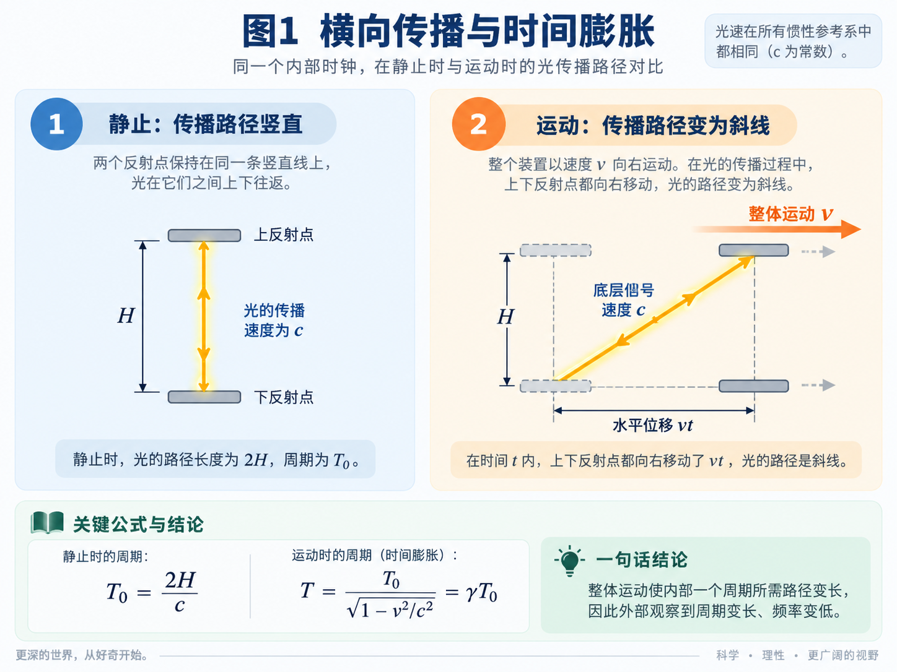
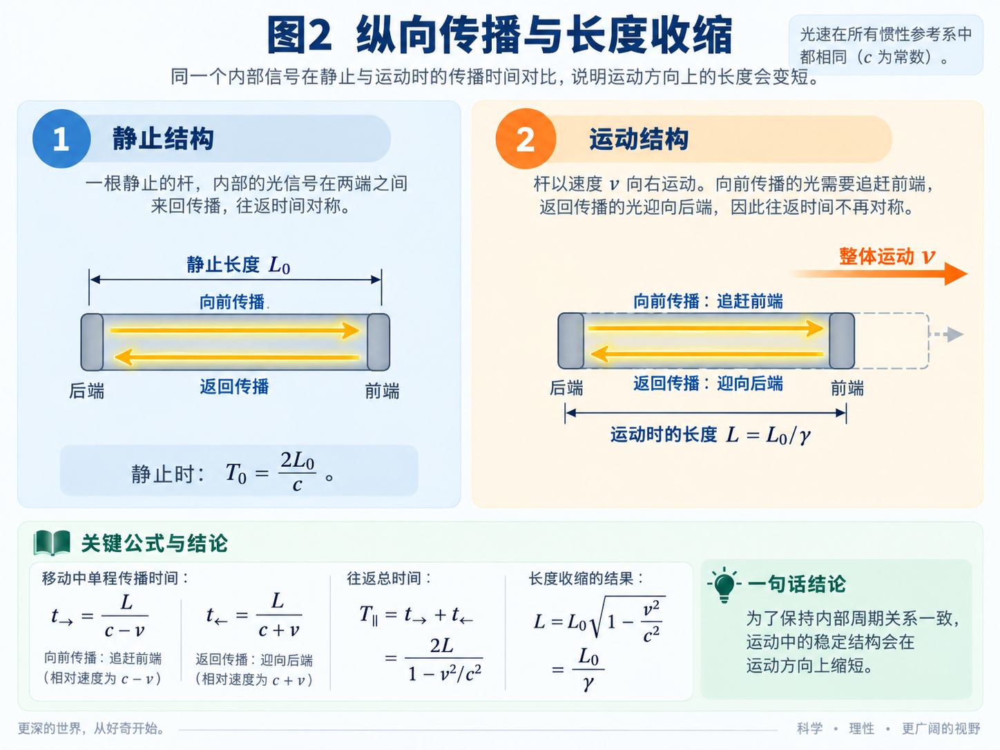
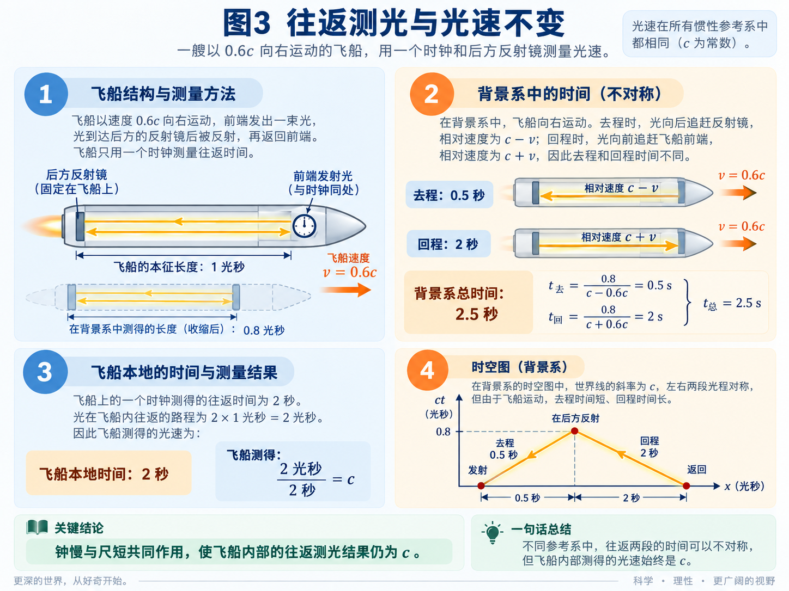
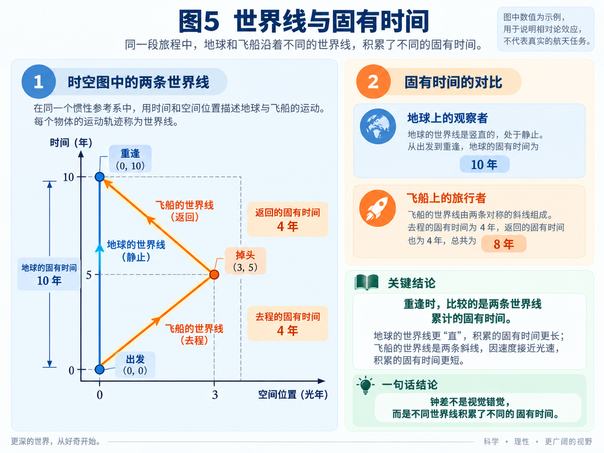
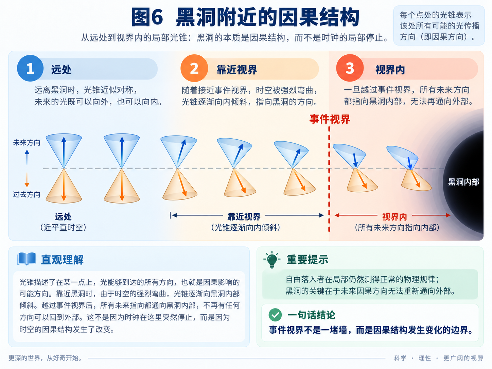

## 第一章｜为什么不只是一只钟变慢

你是否也一直觉得，自己好像知道相对论在说什么，却始终没有真正弄明白？为什么不只钟会慢，化学反应和人的心跳也会一起慢？钟都慢了，为什么测出的光速还不变？为什么两个人都说对方的钟慢，重逢时却真的有人更年轻？

这篇文章尝试换一幅图理解这些问题。想象一只透明盒子，里面有一个光点不停地上下往返。它每跑完一趟，计数器就跳一下。现在让盒子向前飞，光点还能按原来的节奏跑完这一趟吗？

## 第二章｜把物体想成不停运转的东西

再大胆想一步：看似静止的物质，内部其实也可以一直在运动。这里的“振动”不是普通的左右摇晃，而是物质内部从未停止的传播、循环和变化。

钟表、化学反应和心跳看起来不同，却都要依靠内部过程向前推进。这幅模型的关键设想是：

> 物质内部的传播受光速 $c$ 这个共同上限约束。光速不只限制光能走多快，也限制物质内部完成一次变化能有多快。

## 第三章｜盒子向前飞，内部为什么会慢

盒子停着时，光点上下跑，路线是直的。盒子向右飞时，上面的落点也在向右移动。光点要追上它，就必须走一条斜线。

光点仍然以光速前进，但它要多走一段路，完成一次往返自然需要更多时间。这就是光速与计时发生关系的地方：路程增加了，一次“跳动”所需的时间也会增加。

假设盒子向右飞行的速度是 $0.6c$。在这幅图里，完整的光速可以分成两个互相垂直的部分：一个部分让盒子向右运动，另一个部分维持盒子内部的循环。

$$
v_{\text{空间}}^2+v_{\text{内部}}^2=c^2
$$

代入 $v_{\text{空间}}=0.6c$：

$$
v_{\text{内部}}
=c\sqrt{1-0.6^2}
=0.8c
$$

所以，盒子向右运动的分量是 $0.6c$，维持内部变化的分量只剩下 $0.8c$。完成同样一次循环所需的时间就变成：

$$
\gamma=\frac{1}{0.8}=1.25
$$

这就是这幅模型最想表达的画面：**物质仿佛始终以光速穿过时空。运动的箭头越偏向空间中的前进，相对于外界，能够用来维持内部变化的部分就越少。**

如果原子、分子、化学反应和神经信号都由受同一上限约束的内部过程维持，那么慢下来的就不只是一只光钟，而是整套物理过程。

例如，飞船里有一瓶反应物。飞船上的人说反应经过 $1$ 秒完成；地球给同一段反应计时，会得到 $1.25$ 秒。光点并没有碰到反应物，它只是帮助我们画出同一个飞船内部的 $1$ 秒为什么会对应地球的 $1.25$ 秒。

飞船上的人不会感觉自己的反应、心跳或思考变慢，因为他的身体和钟表由同一套本地过程组成。在他看来，一切仍然正常。

## 第四章｜运动方向为什么会缩短

再让一个信号沿飞船的前后方向往返。去程时，它要追赶正在远离的船头；回程时，它迎向船尾。

如果运动方向的长度完全不变，这个纵向循环就无法与刚才的横向循环保持同一节拍。一个稳定结构不能让不同方向各自按照互相冲突的周期运行。因此在这幅图里，内部周期改变时，运动方向的平衡长度也必须一起调整。

相对论给出的长度关系是：

$$
L=L_0\sqrt{1-\frac{v^2}{c^2}}
$$

当 $v=0.6c$ 时：

$$
L=0.8L_0
$$

飞船自己测量自身，长度仍然正常；站台必须在同一个站台时刻记录船头和船尾的位置，才会测得飞船长度是原来的 $0.8$ 倍。

这里的“同一时刻”非常重要。尺缩不是照片上看着变窄，也不是飞船乘客感觉自己受到挤压。它是一个参考系同时测量运动物体两端位置得到的结果。

## 第五章｜为什么光速不变

钟慢了，为什么测出的光速还不变？回答之前，先看我们到底怎样测光速。

$$
\text{速度}=\frac{\text{路程}}{\text{时间}}
$$

所以测量光速至少需要一段由本地尺确定的距离，以及记录光传播时间的本地钟。尺、钟和测量步骤必须属于同一个参考系，不能拿飞船测得的长度去除以站台钟记录的时间。

### 一只钟：测往返光速

在飞船一端安装发光器和一只钟，另一端安装反射镜。光出发时开始计时，反射后回到原处时停止计时。出发和返回发生在同一地点，因此只需要一只钟。

仍用前面的例子：飞船自身长度是 $1$ 光秒，以 $0.6c$ 飞行。飞船上的人测得光往返走过 $2$ 光秒，自己的钟经过 $2$ 秒：

$$
\frac{2\text{ 光秒}}{2\text{ 秒}}=c
$$

站台会怎样描述同一次实验？

站台测得飞船长度为 $0.8$ 光秒。光先迎向船尾，用时 $0.5$ 秒；反射后再追赶船头，用时 $2$ 秒。总时间是：

$$
0.5+2=2.5\text{ 秒}
$$

在这 $2.5$ 秒里飞船一直前进，所以站台看到光实际走过的总路程也是 $2.5$ 光秒：

$$
\frac{2.5\text{ 光秒}}{2.5\text{ 秒}}=c
$$

飞船和站台对长度、时间和光路的看法不同，但各自使用自己的尺和钟，最后都测得光速为 $c$。

### 两只钟：测单程光速

要直接测量光从船头到船尾的单程速度，需要在两端各放一只钟。问题随即出现：两只相隔很远的钟怎样同步？

一个看起来很自然的方法，是先把两只钟放在一起校准，再把其中一只送到另一端。但钟在搬运过程中仍在走，搬运本身又是一段运动。它到达另一端后，不能只因为出发前读数相同，就认定两只钟仍然同步。

另一种方法，是从飞船中点同时向两端发出光信号。两端收到信号时，把钟调成相同读数。飞船认为中点到两端距离相等，光同时到达，所以两只钟已经同步。

站台却不认为这两只飞船时钟同步。飞船自身长度为 $1$ 光秒、速度为 $0.6c$ 时，两端钟的同步差为：

$$
\Delta t=\frac{vL_0}{c^2}=0.6\text{ 秒}
$$

例如，光从船头射向船尾。站台计算出光只飞了 $0.5$ 秒；但发光时，船尾的钟已经领先船头 $0.6$ 秒，飞行期间船尾钟又前进了 $0.4$ 秒。于是船头发光时读作 $0$ 秒，船尾收到光时正好读作 $1$ 秒。飞船仍然得到：

$$
\frac{1\text{ 光秒}}{1\text{ 秒}}=c
$$

现在可以看出，只说“运动的钟慢了”是不够的。完整的测量还必须同时包含：

- 钟的节拍；
- 运动方向的长度；
- 不同位置的钟怎样同步。

在动态结构的图景里，这三件事本来就是同一整体的三个方面。整体运动时，内部节拍、纵向长度和不同位置的相位关系一起改变，因此每个观察者用自己的尺和钟测量本地光速，结果始终都是 $c$。

## 第六章｜为什么哥哥回来时会比弟弟年轻

弟弟留在地球，哥哥乘飞船以 $0.6c$ 出发。按照地球的钟，哥哥飞行 $5$ 年，在距离地球 $3$ 光年的地方立刻掉头，再飞行 $5$ 年返回。

两个人出发前把钟放在一起校准，旅途中不断向对方发送带有时间读数的画面。这个实验里有三个容易混淆的问题：

1. 望远镜里什么时候看见哥哥掉头？
2. 双方收到的画面是快放还是慢放？
3. 重逢时，两只真实钟表各走了多久？

### 先只看光的传播延迟

暂时假设两只钟走得一样快，只看信号需要时间才能传到对方。

哥哥远离时，后一束光比前一束多走一段路，画面会被拉开。哥哥接近时，后一束光少走一段路，画面会被压紧。

只考虑这一层传播延迟，远离时的画面速度为：

$$
\frac{1}{1+0.6}=0.625
$$

接近时为：

$$
\frac{1}{1-0.6}=2.5
$$

哥哥在地球第 $5$ 年已经掉头，但“掉头画面”还要从 $3$ 光年外传回来，因此弟弟直到第 $8$ 年才看到哥哥转身。弟弟收到的是旧画面，不代表哥哥此刻仍在远离。

这种画面快慢由光程造成。运动方向反过来，慢放就会变成快放；交换观察者，也会得到同样的远离与接近规律。因此它是对称并且可逆的。

### 再看两个人真正经历了多久

现在把光在路上花费的时间校正掉，只比较两只钟真正积累的时间。

速度为 $0.6c$ 时，时间倍率是 $0.8$。在地球的去程 $5$ 年中，哥哥只经历：

$$
5\times0.8=4\text{ 年}
$$

返程仍然是 $4$ 年。因此重逢时：

$$
\text{弟弟}=10\text{ 年},\qquad
\text{哥哥}=8\text{ 年}
$$

返程没有让哥哥的钟突然加快。真正的不对称发生在掉头：哥哥从去程参考系换到了返程参考系，而弟弟始终留在同一个惯性参考系。

在去程参考系中，哥哥把遥远地球的“现在”判断为第 $3.2$ 年；掉头换到返程参考系以后，他把地球的“现在”判断为第 $6.8$ 年。地球钟并没有突然快走，改变的是哥哥用哪一组“同时”去连接自己和遥远的地球。

两个人走过的完整时空路径不同，因此积累的自身时间也不同。

### 最后看双方实际收到的画面

真实画面同时包含传播延迟和相对论钟慢。

弟弟看哥哥远离时：

$$
0.625\times0.8=0.5
$$

弟弟在前 $8$ 年看到哥哥以 $0.5$ 倍速生活，因此画面中的哥哥经过 $4$ 年；最后 $2$ 年收到返程的密集信号，画面以 $2$ 倍速播放，哥哥又经过 $4$ 年。重逢时，画面中的哥哥和他手里的钟都显示 $8$ 年。

哥哥去程的 $4$ 年里，也看到弟弟的画面是 $0.5$ 倍速，因此只看到弟弟经过 $2$ 年；返程的 $4$ 年里，画面变成 $2$ 倍速，又看到弟弟经过 $8$ 年。重逢时，他看到弟弟总共经历 $10$ 年。

所以必须把两件事分开：

- **多普勒画面的快慢**是对称、可逆的。远离时双方都看见慢放，接近时双方都看见快放。
- **重逢时的年龄差**不会在返程时倒过来。两条不同的时空路径分别积累了 $8$ 年和 $10$ 年。

光线决定途中看见什么，参考系决定怎样比较远处的同时，完整路径决定自己真正经历多久。

## 第七章｜相对论效应怎样表现为电磁力

电子静止时，周围的电场对称分布。另一个静止电子放在旁边，会受到普通的电力排斥。

第一个电子运动起来以后，尺缩会改变电场的空间分布。但只有尺缩还不够，因为它不能解释：为什么另一个电子同向运动时，斥力减小；反向运动时，斥力反而增大。

要得到这个方向差别，还必须考虑第二个电子怎样运动，以及钟慢以后，电场作用怎样随外界时间累计。

仍用 $0.6c$ 举例。内部节拍是原来的 $0.8$ 倍，外界比较时对应的倍数为：

$$
\frac{1}{0.8}=1.25
$$

假设两个静止电子之间原本有一份斥力 $F_0$。运动以后，经过空间分布和时间累计共同修正的横向电力为 $1.25F_0$。与运动方向有关的部分占：

$$
0.6^2=0.36
$$

所以这部分作用为：

$$
F_{\text{运动}}=1.25\times0.36F_0=0.45F_0
$$

两个电子同向运动时，这部分作用向内，会抵消一部分斥力：

$$
F_{\text{同向}}=1.25F_0-0.45F_0=0.8F_0
$$

两个电子反向运动时，它的方向反过来，会增强斥力：

$$
F_{\text{反向}}=1.25F_0+0.45F_0=1.7F_0
$$

这个会随运动方向改变正负的 $0.45F_0$，就是对外表现出的磁作用。在这幅直觉图里，它由电场空间分布的改变和作用累计的改变共同产生。

导线只是把许多这样的电子排在一起。没有电流时，正负电荷的作用互相抵消，导线整体呈电中性。通电以后，电子开始定向运动：

- 两根导线中的电子同向运动，电子之间的排斥减小，剩余吸引使导线靠近；
- 电子反向运动，排斥增强，导线便会分开。

这就是同向电流相吸、反向电流相斥。宏观磁力，可以看成大量电子的这种微小相对论效应叠加起来的结果。

所以在这套模型里，磁场不是电子凭空产生的第二种场。它是电子运动以后，原有电场受到尺缩、钟慢和运动方向共同影响，对外呈现出来的另一部分。

## 第八章｜引力为什么会让时间变慢

在这幅模型里，一只钟之所以能够走动，是因为它内部的信号能够传播并完成循环。原子振荡、化学反应、神经信号和心跳，也都需要底层过程不断传播和变化。

如果引力使一个位置相对于远处参考系的有效光速降低，那么所有依赖这些传播过程的物理现象都会一起变慢。

可以在高处和低处各放一只完全相同的光钟。用远处同一套时间标准比较，低处的光完成一次往返需要更久，低处的原子、化学反应和普通钟表也按同一比例减少节拍。因此远处观察者会说：引力越强，时间越慢。

低处的人为什么感觉不到？因为他的钟、尺、心跳和思考速度都由同一套本地过程组成。他用本地的尺和本地的钟测量光速，结果仍然正常。这里所说的“光速变慢”，指用远处统一的坐标、尺和钟比较时得到的有效传播速度。只有把高处和低处的钟重新放在一起，或者交换光信号比较，时间差才会显现出来。

### 自由落体

可以把引力区域想象成空间本身正在向引力中心流动。被悬停的物体抵抗着这种流动；自由落体的物体则和附近的空间一起运动。

因此，自由落体者在一个很小的局部范围内，仍然觉得自己的钟、光和物理过程完全正常。他真正积累多少时间，取决于沿途每个位置的本地传播条件和整条运动路径。把他的钟与远处的钟重新比较，才会发现两条路径积累了不同的时间。

用动态结构的语言说，时间不是脱离物理过程单独流动的东西；它就是本地光速所约束的所有循环能够完成多少次。

### 黑洞

黑洞把这幅图推到了极端。越靠近黑洞，空间向内流动得越快，光相对于远处坐标能够向外推进的速度越小。在事件视界处，空间向内的流动恰好抵消光向外传播的能力；越过视界以后，即使光在本地仍以正常光速向外发射，相对于外部，它仍会被带向黑洞内部。

继续把模型向黑洞中心外推，有效传播速度会不断降低。在中心极限，可以把它表示为：

$$
c_{\text{有效}}\rightarrow0
$$

信号无法再完成空间传播，依赖传播的内部循环也无法完成。如果时间是通过这些循环和变化来定义的，那么在这个极限，“经过了多少时间”也会失去可以实际测量的意义。

对正在下落的人来说，在到达这个中心极限以前，他的本地钟和本地物理过程仍然正常。他不会在穿过事件视界的一瞬间看见自己的钟停住。

## 第九章｜$E=mc^2$

我们无法把一颗高速飞行的物体直接放到秤上。外界要判断它表现出多大的惯性，只能给它施加已知的力或能量，再观察它的速度改变多少。

低速时，同样一次推动能带来明显的速度变化；速度越接近光速，同样的推动带来的速度增加越小。按照这种测量方式，高速物体表现得就像质量增加了。

洛伦兹因子为：

$$
\gamma=\frac{1}{\sqrt{1-\frac{v^2}{c^2}}}
$$

几个速度对应的总能量如下：

| 速度 | $\gamma$ | 总能量 |
| --- | ---: | ---: |
| $0.6c$ | $1.25$ | $1.25mc^2$ |
| $0.8c$ | 约 $1.67$ | 约 $1.67mc^2$ |
| $0.99c$ | 约 $7.09$ | 约 $7.09mc^2$ |

速度仍然没有达到光速，但继续提高一点速度所需的能量已经快速增加。反过来让物体停下，这些增加的能量和动量又必须真实地转移给制动装置、其他物体或辐射。

现代物理通常把不随速度改变的 $m$ 称为静质量，把增加的部分称为能量和动量。早期也常把总能量除以 $c^2$ 称为“相对论质量”。两种说法描述的是同一个现象：速度越接近光速，物体越难继续加速，也越难停下来。

### 怎样看懂 $E=mc^2$

这里不展开完整推导，只看最关键的一步。相对论把总能量、运动带来的动量和物体自身的质量放在同一个关系中：

$$
E^2=(pc)^2+(mc^2)^2
$$

可以把它想成一个直角三角形：总能量 $E$ 是斜边，运动部分 $pc$ 和静止部分 $mc^2$ 是两条直角边。

物体停着时，动量 $p=0$，运动的那条边消失，于是只剩下：

$$
E=mc^2
$$

这不是说静止物体藏着一份动能，而是说质量本身就对应着能量。

物体运动以后，总能量为：

$$
E=\gamma mc^2
$$

例如速度为 $0.6c$ 时，总能量是 $1.25mc^2$。其中 $1mc^2$ 是物体静止时已经具有的能量，多出的 $0.25mc^2$ 才是运动带来的能量。让物体停下时，能够转移出去的是多出的这部分，静止能量仍然留在物体自身。

### 为什么有质量的物体到不了光速

回到动态结构模型。有质量的物体不是一个完全静止的实心点，而是一套依靠内部传播维持的稳定结构。即使整体静止，内部仍然有传播、振荡、场能和束缚能。这些内部能量共同组成它的静止能量，所以静质量可以看成内部总能量的度量。

当整个结构加速时，越来越多的传播方向表现为空间运动，相对于外界，维持内部节拍的分量越来越少。当 $v$ 接近 $c$ 时：

$$
\sqrt{1-\frac{v^2}{c^2}}\rightarrow0,
\qquad
\gamma\rightarrow\infty
$$

此时继续输入能量，能量和动量会快速增加，速度却只能越来越缓慢地接近光速。

如果一个有质量的结构真正达到光速，它的自身时间将不再推进，维持物质结构的内部循环也无法完成。要把一个仍有静质量和内部时间的结构推到这个状态，需要无限大的能量。

因此，有质量的物体可以无限接近光速，却不能靠有限能量达到光速。光本身没有静止参考系，它不是一件先静止、再被加速到光速的有质量物体。

核反应中的质量亏损也可以放进这幅图理解。原子核重新组合以后，如果新的稳定结构具有更低的内部总能量，多出的能量便会以光、热或粒子动能等形式离开。减少的质量不是物质凭空消失，而是原先计入静质量的内部能量被释放了：

$$
\Delta E=\Delta mc^2
$$

## 结尾｜这幅直觉模型能做什么

这篇文章只是帮助理解相对论的一种直觉模型。它尝试用底层传播、运动方向和内部循环，把时间变慢、长度变化、光速不变、双生子、电磁力、引力以及质量与能量放进同一幅图景，让这些原本难以联系的现象变得更容易想象。

这种图景不是严谨的物理推导，也不代表真实的物质结构和物理过程一定就是这样运行的。它不能代替相对论的数学公式，也不能单独用来预言新的实验结果。它提供的是一种内部自洽的理解方式：当你再看到相对论中那些违反日常直觉的结论时，可以先借助这幅动态图景建立一个方向，再进一步理解严格的理论。

> 本文由「[Yank Note - 一款强大可扩展的 Markdown 编辑器，为生产力而生](https://github.com/purocean/yn)」撰写
